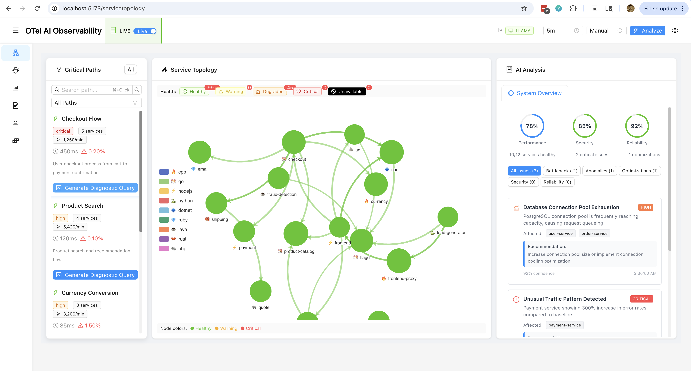
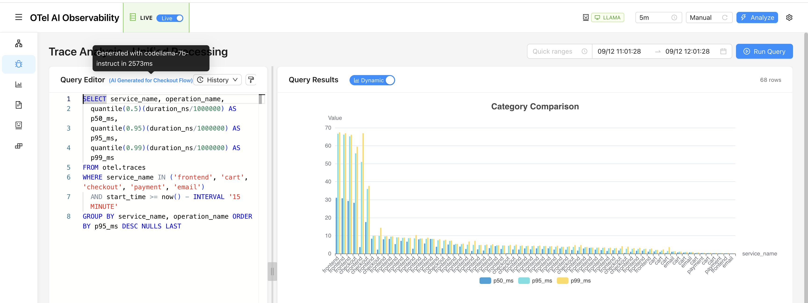
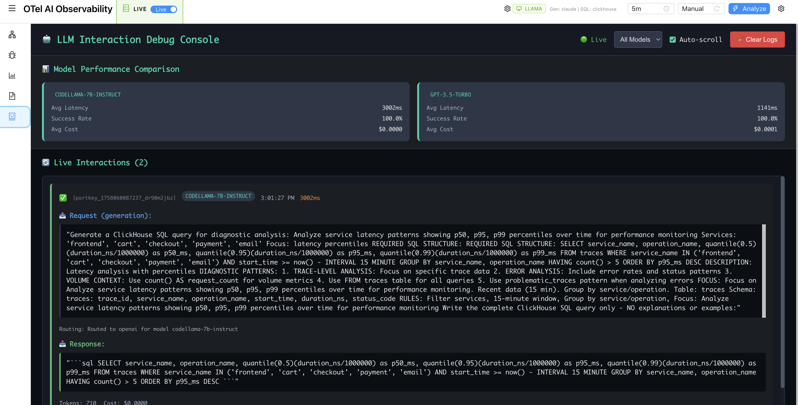
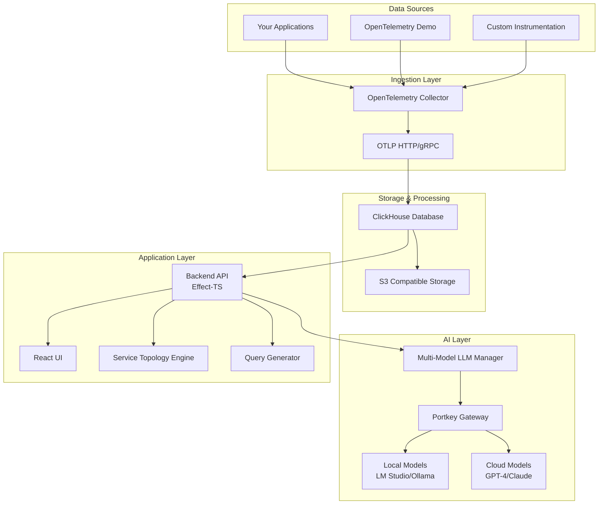

# OTel AI - AI-Native Observability Platform

> Enterprise-grade observability platform that leverages AI at its core for intelligent system insights, real-time anomaly detection, and adaptive monitoring.



## Overview

OTel AI is a production-ready observability platform built on OpenTelemetry that integrates machine learning and AI capabilities from the ground up. Unlike traditional monitoring tools that add AI as an afterthought, this platform uses AI to understand your system's behavior, automatically generate insights, and provide adaptive monitoring that evolves with your infrastructure.

### Key Features

- **🧠 AI-Powered Analysis** - Multi-model LLM orchestration (GPT-4, Claude, Llama) for intelligent system insights
- **📊 Dynamic Visualization** - Automatically generated dashboards and queries based on your data patterns
- **🔍 Smart Diagnostics** - AI-generated diagnostic queries that adapt to your service topology
- **⚡ Real-Time Processing** - ClickHouse-powered analytics with sub-second query performance
- **🎯 OpenTelemetry Native** - Full OTLP support with automatic instrumentation
- **🔄 Service Topology Discovery** - Automatic detection and visualization of service dependencies

## Quick Start

### Prerequisites
- Docker & Docker Compose
- Node.js 18+ with pnpm
- 8GB RAM minimum (16GB recommended)
- Ports 5173, 8123, 4318, 8787 available

### Installation

```bash
# Clone the repository
git clone https://github.com/clayroach/otel-ai.git
cd otel-ai

# Install dependencies
pnpm install

# Start the platform
pnpm dev:up        # Start all services (ClickHouse, OTel Collector, Backend)
pnpm dev           # Start development UI server

# Access the platform
open http://localhost:5173
```

### Try with Demo Data

Experience the platform with realistic microservices telemetry:

```bash
# Start the OpenTelemetry demo (15+ microservices)
pnpm demo:up

# Access the load generator
open http://localhost:8089

# View telemetry flowing through your platform
open http://localhost:5173
```

## Screenshots & Features

### Service Topology Visualization


The platform automatically discovers and visualizes your service topology, showing:
- Real-time service health with color-coded status
- Critical path identification and latency analysis
- Automatic anomaly detection with AI-powered insights
- One-click diagnostic query generation

### AI-Generated SQL Queries


Features include:
- AI-powered SQL generation based on natural language
- Context-aware queries that understand your service topology
- Performance optimized queries with automatic indexing hints
- Support for multiple SQL dialects (ClickHouse optimized)

### LLM Interaction Debugging


Developer-friendly features:
- Real-time LLM interaction monitoring
- Token usage and cost tracking
- Model performance comparison (GPT-4 vs Claude vs Llama)
- Request/response debugging with full visibility

## Architecture



## Production Deployment

### Docker Compose (Recommended)

```bash
# Production deployment with all services
docker compose -f docker-compose.yaml up -d

# Check service health
docker compose ps
docker compose logs -f
```

### Configuration

All configuration is managed through environment variables and YAML files:

```bash
# Core configuration files
config/
├── portkey/           # LLM routing configuration
│   └── config.json
├── otel-collector/    # OpenTelemetry Collector config
│   └── config.yaml
└── llm-manager/       # AI model preferences
    └── config.yaml
```

### Environment Variables

```bash
# Required for cloud LLM features
OPENAI_API_KEY=your-key-here
ANTHROPIC_API_KEY=your-key-here

# Optional for local models
LM_STUDIO_ENDPOINT=http://localhost:1234
OLLAMA_ENDPOINT=http://localhost:11434
```

## Key Capabilities

### 1. Intelligent Query Generation
- Natural language to SQL conversion
- Context-aware query optimization
- Multi-model support (GPT-4, Claude, CodeLlama)
- Automatic query caching and optimization

### 2. Service Topology Analysis
- Automatic service discovery from traces
- Critical path identification
- Latency bottleneck detection
- Dependency mapping with health indicators

### 3. Anomaly Detection
- Real-time pattern analysis
- Predictive alerting based on historical data
- Automatic root cause analysis
- Configurable sensitivity thresholds

### 4. Multi-Model AI Orchestration
- Seamless routing between cloud and local models
- Automatic failover and retry logic
- Cost optimization through intelligent model selection
- Support for GPT-4, Claude, Llama, CodeLlama, and more

## API Documentation

### REST API Endpoints

```typescript
// Service Topology
GET /api/servicetopology/paths
GET /api/servicetopology/paths/:pathId

// Query Generation
POST /api/query-generator/generate
{
  "prompt": "Show me the slowest services in the last hour",
  "context": "checkout-flow"
}

// Traces
GET /api/traces?service=frontend&limit=100
POST /api/traces/analyze
```

### WebSocket Support

Real-time updates for:
- Live trace streaming
- Service health monitoring
- Anomaly alerts
- Query execution progress

## Development

### Project Structure

```
otel-ai/
├── src/
│   ├── storage/        # ClickHouse integration
│   ├── ai-analyzer/    # ML/AI analysis engine
│   ├── llm-manager/    # Multi-model LLM orchestration
│   ├── ui-generator/   # Dynamic UI components
│   ├── server/         # Backend API server
│   └── ui/            # React frontend application
├── config/            # Configuration files
├── docker/            # Docker configurations
└── notes/            # Documentation & specs
```

### Running Tests

```bash
# Unit tests
pnpm test

# Integration tests
pnpm test:integration

# E2E tests
pnpm test:e2e

# Full test suite
pnpm test:all
```

### Contributing

We welcome contributions! Please see our [Contributing Guide](CONTRIBUTING.md) for details.

Key areas for contribution:
- Additional AI model integrations
- Enhanced visualization components
- Performance optimizations
- Documentation improvements

## Performance

### Benchmarks

- **Ingestion Rate**: 100K+ spans/second
- **Query Performance**: Sub-second for most queries
- **Storage Efficiency**: 10:1 compression ratio
- **AI Response Time**: <3s for complex queries
- **UI Responsiveness**: 60 FPS with 10K+ nodes

### Scalability

The platform is designed to scale horizontally:
- ClickHouse cluster support for storage
- Multiple OTel Collector instances
- Load-balanced API servers
- Distributed AI model serving

## Roadmap

### Current Release (v1.0)
- ✅ Core platform with OTLP ingestion
- ✅ Multi-model LLM integration
- ✅ Service topology visualization
- ✅ Dynamic query generation
- ✅ Real-time trace analysis

### Upcoming Features

#### Next Release
- **🎯 LLM-Guided SRE Diagnostics** ([ADR-016](notes/design/adr/adr-016-llm-guided-sre-diagnostics.md)) - Hypothesis-driven investigation with sliding autonomy control
- **📊 Enhanced End User Monitoring** ([ADR-010](notes/design/adr/adr-010-enhanced-end-user-monitoring-framework.md)) - Comprehensive browser auto-instrumentation and RUM
- **🔍 Advanced Anomaly Detection** - Autoencoder-based pattern recognition for automatic incident detection
- **💰 Cost Analysis Dashboard** ([ADR-004](notes/design/adr/adr-004-self-monitoring-and-cost-analysis.md)) - Real-time LLM token usage and infrastructure cost tracking

#### Planned Enhancements
- **🤖 MCP Server Integration** ([ADR-007](notes/design/adr/adr-007-mcp-server-architecture-aiops-integration.md)) - Model Context Protocol for LLM-native interfaces
- **📸 Automated Screenshot Management** ([ADR-012](notes/design/adr/adr-012-screenshot-image-management-cloudinary-integration.md)) - Cloudinary integration for visual documentation
- **🔮 ML-Powered Forecasting** - Capacity planning and trend prediction based on historical patterns
- **🚨 Intelligent Alert Correlation** - Reduce noise by grouping related alerts and identifying root causes

#### Future Vision
- **🏗️ Kubernetes Operator** - Auto-instrumentation for K8s workloads with CRDs
- **📊 Business Metrics Correlation** - Connect technical metrics to business KPIs and revenue impact
- **🌍 Multi-Region Support** - Distributed tracing across global deployments
- **🔐 Compliance & Audit Features** - GDPR/HIPAA compliant data retention and access controls

## Support & Community

- **Documentation**: [Full documentation](https://github.com/clayroach/otel-ai/wiki)
- **Issues**: [GitHub Issues](https://github.com/clayroach/otel-ai/issues)
- **Discussions**: [GitHub Discussions](https://github.com/clayroach/otel-ai/discussions)
- **Blog**: [Development insights on Dev.to](https://dev.to/clayroach)

## License

MIT License - see [LICENSE](LICENSE) for details.

---

**Built with Effect-TS, OpenTelemetry, and AI** | **Accelerated development with [Claude Code](https://claude.ai/code)**