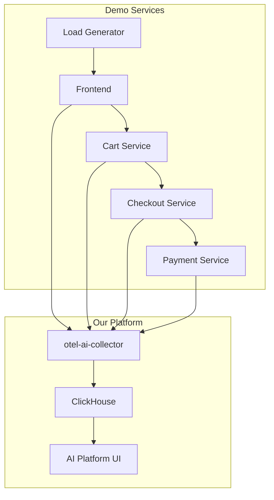

# OpenTelemetry Demo Integration

This directory contains the integration setup for the official OpenTelemetry Demo with our AI-native observability platform.

## Overview

We implement a "Bring Your Own Backend" approach as described in the [OpenTelemetry Demo documentation](https://opentelemetry.io/docs/demo/docker-deployment/#bring-your-own-backend). This allows us to:

- Use the latest official OpenTelemetry demo source code
- Keep our customizations separate and minimal  
- Send all demo telemetry to our `otel-ai-collector` instead of the demo's built-in collector

## Directory Structure

```
demo/
├── README.md                    # This file
└── otel-demo-app/              # Cloned OpenTelemetry demo (gitignored)
    ├── .env.override           # Our configuration overrides
    ├── docker-compose.override.yml  # Docker compose overrides
    └── setup-otel-ai.sh        # Setup verification script
```

## Usage

### Initial Setup

1. **Ensure your platform is running:**
   ```bash
   pnpm dev:up
   ```

2. **Clone and setup the demo:**
   ```bash
   pnpm demo:clone    # Clone the latest demo source
   pnpm demo:setup    # Apply our configuration
   ```

### Running the Demo

```bash
# Start the demo (automatically checks platform status)
pnpm demo:up

# View logs
pnpm demo:logs

# Check status
pnpm demo:status

# Stop the demo
pnpm demo:down

# Clean up (removes containers and volumes)
pnpm demo:clean
```

### Access Points

Once running:

- **Demo Frontend**: http://localhost:8080
- **Load Generator UI**: http://localhost:8089  
- **Your AI Platform**: http://localhost:5173

## Configuration

Our integration applies these key changes:

### Network Integration
- Uses the `otel-ai-network` to connect to our platform
- Points all telemetry to `otel-ai-collector:4317/4318`

### Service Modifications
- Disables demo's built-in collector, Jaeger, Grafana, Prometheus
- Reduces resource usage (fewer Locust users)
- Maintains all demo services (frontend, cart, checkout, etc.)

### Files Created
- `.env.override` - Environment variable overrides
- `docker-compose.override.yml` - Docker compose service modifications
- `setup-otel-ai.sh` - Platform verification script

## Troubleshooting

### Platform Not Running
```
ERROR: otel-ai-network not found. Please run 'pnpm dev:up' in the main project first.
```
**Solution:** Start your platform first with `pnpm dev:up`

### Demo Services Failing
Check that our collector is accessible:
```bash
docker exec -it otel-ai-collector curl -f http://localhost:4318/v1/traces
```

### Fresh Start
```bash
pnpm demo:clean    # Clean up everything
pnpm dev:reset     # Reset platform
pnpm demo:setup    # Reconfigure demo
pnpm demo:up       # Start fresh
```

## Architecture



The demo services send telemetry to our collector, which processes and stores it in ClickHouse for analysis in our AI platform.