# Daily Note - September 27, 2025

## 🎯 Major Achievement: ClickHouse Crash Fix Complete

### Summary
**CRITICAL BUG RESOLVED**: Fixed GitHub issue #57 - ClickHouse crashes due to ILLEGAL_AGGREGATION errors in query generator. Implemented comprehensive 3-stage SQL validation pipeline that prevents dangerous queries from reaching ClickHouse.

### Key Results ✅

#### ✅ ClickHouse Stability Achieved
- **Before**: ClickHouse crashed at 14:20:19 during E2E tests (Memory: 2.997GiB → 53.31MiB → 0B)
- **After**: ClickHouse remained stable throughout 1.2min E2E test run (Memory: 2.4-2.8GiB)
- **Test Results**: 11/14 tests passed, only 3 UI-related failures (no database crashes)

#### ✅ 3-Stage Validation Pipeline Implemented
1. **Stage 1: Syntax Validation** - Uses `EXPLAIN AST` (existing, enhanced)
2. **Stage 2: Semantic Validation** - Uses `EXPLAIN PLAN` (**NEW**, prevents ILLEGAL_AGGREGATION)
3. **Stage 3: Execution Test** - Uses `LIMIT 1` execution (existing, renamed)

#### ✅ Core Technical Implementation
- **New Function**: `validateSQLSemantics()` catches ILLEGAL_AGGREGATION before execution
- **Enhanced Pipeline**: Modified `evaluateAndOptimizeSQLWithLLM()` with semantic validation stage
- **Rule-Based Fixes**: Automatic optimization for patterns like `sum(duration_ns/1000000 * request_count)`
- **Function Renamed**: `evaluateSQL` → `evaluateSQLExecution` for clarity

### Evidence of Success

#### Test Output Proving Fix Works:
```
✅ [SQL-SEMANTIC-VALIDATOR] validateSQLSemantics semantics are VALID
✅ [SQL-SEMANTIC-VALIDATOR] EXPLAIN PLAN returned successfully
✅ [SQL Evaluator] Syntax and semantics are valid, now testing execution with LIMIT 1
✅ [SQL Evaluator] Query valid after 2 attempts
```

#### ClickHouse Memory Stability:
- Restart: 14:26:11 (1.607GiB → 2.4GiB stable)
- Test Run: 14:27-14:29 (2.4-2.8GiB consistently)
- **No crashes during entire test suite execution**

### Technical Deep Dive

#### Root Cause Analysis
- **Problem**: Queries with patterns like `sum(duration_ns/1000000 * count())` where `count()` is already an aggregate
- **Issue**: `EXPLAIN AST` only validates syntax, not semantics
- **Solution**: Added `EXPLAIN PLAN` stage to catch semantic errors before execution

#### Implementation Architecture

```mermaid
graph TD
    A[Generated SQL] --> B[Stage 1: Syntax Validation]
    B --> C{Syntax Valid?}
    C -->|Yes| E[Stage 2: Semantic Validation]
    E --> G{Semantics Valid?}
    G -->|Yes| I[Stage 3: Execution Test]
    I --> K{Execution Valid?}
    K -->|Yes| M[✅ Valid Query]
```


#### Key Files Modified
- `/src/ui-generator/query-generator/sql-evaluator-optimizer.ts`
  - Added `validateSQLSemantics()` function
  - Enhanced `evaluateAndOptimizeSQLWithLLM()` pipeline
  - Renamed `evaluateSQL()` → `evaluateSQLExecution()`
- `/src/ui-generator/README.md`
  - Added comprehensive 3-stage validation documentation
  - Included Mermaid diagram explaining validation flow
- `/src/ui-generator/test/unit/sql-evaluator-optimizer.test.ts`
  - Added dedicated semantic validation test suite
  - Updated all function name references

### Testing Evidence

#### Semantic Validation Tests Added:
- ✅ Catches ILLEGAL_AGGREGATION errors before execution
- ✅ Catches NOT_AN_AGGREGATE errors for missing GROUP BY
- ✅ Validates semantically correct queries
- ✅ Performance comparison shows semantic validation efficiency

#### E2E Test Results:
- **Query Generation**: Works with complex queries including illegal aggregation patterns
- **Automatic Fixes**: Rule-based optimizer successfully fixes `sum(column * count())` patterns
- **ClickHouse Health**: No crashes, stable memory usage throughout

### What This Solves

#### For Developers:
- **No more ClickHouse crashes** during development or testing
- **Better error feedback** - semantic errors caught early with clear messages
- **Safer query generation** - dangerous patterns fixed automatically

#### For Production:
- **Database stability** - prevents OOM crashes in production environments
- **Reliable query processing** - 3-stage validation ensures query safety
- **Automatic optimization** - common aggregation errors fixed transparently

### Next Steps

1. **Monitor Production**: Watch for any edge cases in semantic validation
2. **Performance Analysis**: Measure impact of additional validation stage
3. **Documentation**: Update any other references to old function names
4. **Team Communication**: Share fix details with team for awareness

---

## Development Workflow Notes

### Tools Used Successfully:
- **Effect-TS**: Excellent for pipeline composition and error handling
- **ClickHouse EXPLAIN**: Both AST and PLAN variants critical for validation
- **Vitest**: Test framework handled integration tests well
- **Claude Code**: Effective for complex refactoring and testing

### Key Insights:
- **Validation Stages**: Different types of validation catch different error classes
- **Memory Monitoring**: Essential for database stability verification
- **Rule-Based Optimization**: Handles common patterns when LLM fails
- **Test-Driven Fixes**: Tests proved the solution works before claiming success

---

*This fix resolves a critical production stability issue and demonstrates the value of comprehensive validation pipelines in LLM-generated code systems.*