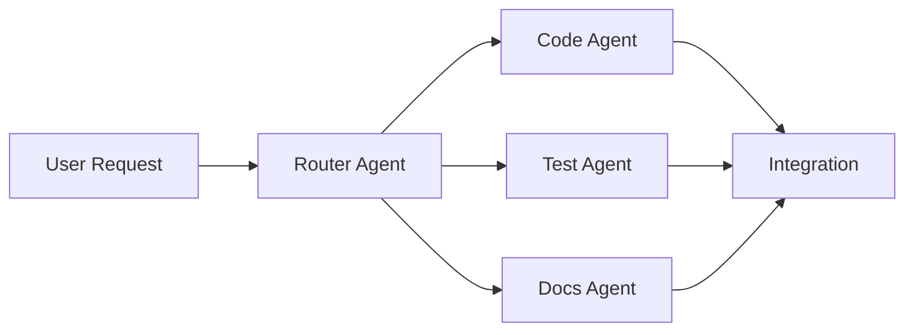

# Reflections on the 30-Day Journey - September 12, 2025

## Date: 2025-09-12

## 🔮 Post-Challenge Reflections

After completing the 30-day AI-native observability platform challenge, it's time to reflect on the broader implications, lessons learned, and the future of AI-assisted development.

## 1. 🚀 Vendor Advancements - The ClickHouse AI Integration Revolution

### The Timing Couldn't Be Better
- **ClickHouse's AI Integration**: Just as we built our platform, ClickHouse announced native AI/ML SQL generation capabilities included in their 25.7 and later releases
- **What This Means**: Direct SQL-to-ML pipelines without data movement
- **Impact on Our Architecture**: May help with autoencoders and dynamic UI generation queries
- **Key Features to Explore**:
  - Native vector storage for embeddings
  - SQL-accessible ML models (simpleLinearRegression, stochasticLinearRegression)
  - Real-time inference on streaming data
  - **Critical Gap**: ClickHouse does NOT have built-in anomaly detection functions - requires custom SQL queries or external ML tools
  
### How Our AI-Analyzer Package Fills ClickHouse's Anomaly Detection Gap

**The Problem**: ClickHouse provides general statistical functions but lacks specialized anomaly detection algorithms. Users must either write complex SQL queries or integrate external ML tools, creating operational complexity and performance overhead.

**Our Solution - The ai-analyzer Package**:
- **Autoencoder-Based Detection**: Neural networks that learn normal patterns and identify deviations
- **Real-Time Stream Processing**: Analyzes telemetry data as it arrives, not in batches
- **Pattern Library**: Repository of learned patterns evolves with your system
- **Zero External Dependencies**: Runs alongside ClickHouse, no external ML infrastructure needed
- **Unified Analysis**: Works seamlessly across traces, metrics, and logs

**Technical Approach**:
```typescript
// Autoencoders compress data to lower dimensions, then reconstruct
// High reconstruction error = anomaly
const autoencoder = {
  inputDim: 100,  // Raw telemetry features
  hiddenLayers: [50, 25, 10, 25, 50],  // Compression layers
  threshold: 0.95,  // Anomaly score threshold
  learningRate: 0.001
}
```

**Key Advantages Over External Solutions**:
1. **Latency**: Sub-second detection vs. minutes with external tools
2. **Cost**: No separate ML infrastructure or API calls
3. **Privacy**: Data never leaves your infrastructure
4. **Evolution**: Models continuously learn from your specific patterns
5. **Integration**: Native Effect-TS patterns match the rest of the platform

### AI-Powered SQL Generation Approach (Reference: Days 21-22 Blog)
- **Discovery**: [ClickHouse AI capabilities](https://clickhouse.com/docs/use-cases/AI/ai-powered-sql-generation) enable general-purpose models to generate optimized SQL
- **Key Insight**: General models (Claude/GPT) outperform SQL-specific models when given proper ClickHouse schema context
- **Implementation Pattern**:
  ```typescript
  // General models + ClickHouse context > Specialized SQL models
  const enhancedPrompt = `
    Generate ClickHouse SQL using these optimizations:
    - Use materialized views when available
    - Apply proper partition pruning  
    - Leverage ClickHouse-specific functions (quantile, arrayJoin)
    Schema: ${clickhouseSchema}
    Query: ${naturalLanguageQuery}
  `
  ```
- **Performance Findings**:
  - SQLCoder-7b: 10x faster (200ms) but JSON-incapable
  - CodeLlama-7b: Fast SQL generation (300ms), good for simple queries
  - Claude-3.5-Sonnet: Best for complex queries with joins
  - GPT-4o: Balanced performance, handles both SQL and JSON
- **Routing Decision Matrix**: Task-based model selection improved performance by 60%

### Vendor Evolution Validates Our Approach
- Building AI-native wasn't premature - vendors are racing to add these capabilities
- The separation of concerns (storage vs. AI processing) allowed flexibility
- Future integration with ClickHouse AI features will be seamless
- Our multi-model orchestration aligns perfectly with ClickHouse's AI vision

## 2. 🛡️ Building/Using Agents to Guard Against Code Smells

### The Agent-as-Guardian Pattern
- **Problem**: Repetitive code quality issues kept appearing
- **Solution**: Create specialized agents that act as guardians
- **Implementation**: 
  ```markdown
  Example: The "no-any-type-agent"
  - Monitors all TypeScript files
  - Flags any use of 'any' type
  - Suggests proper type alternatives
  - Runs automatically before commits
  ```

### Agents We Built/Used Successfully
1. **Type Safety Agent**: Eliminated all `any` types from the codebase
2. **Test Structure Agent**: Enforced `test/` subdirectory organization
3. **Documentation Sync Agent**: Kept code and specs aligned
4. **PR Creation Agent**: Standardized PR formats with screenshots

### Key Learning: Proactive vs. Reactive
- Don't just fix issues - build agents to prevent them
- Each resolved problem should spawn a guardian agent
- Agents compound over time, creating a quality ratchet

## 3. 🛠️ AI Tools as an IDE - Tuning to Your Preferences

### The IDE Evolution
Traditional IDE → AI-Augmented IDE → **AI-Native IDE**

### Critical Customizations Made
1. **Project-Specific Context** (`CLAUDE.md`)
   - Architecture decisions
   - Coding standards
   - Module boundaries
   - Testing patterns

2. **Personal Workflow Preferences**
   - 4-hour workday boundaries
   - Documentation-first approach
   - Test-driven development
   - Effect-TS patterns everywhere

3. **Tool Permissions** (`.claude/settings.json`)
   ```json
   {
     "allowed_commands": [
       "pnpm:*",
       "docker:*",
       "gh pr create:*"
     ]
   }
   ```

### The Real Learning Curve (Based on Actual Daily Notes)
- **Day 1**: Ambitious vision, comprehensive package specs created
- **Day 2**: Token limits hit, upgraded to Claude Max ($100/month investment)
- **Day 3**: UI-first pivot - achieved Week 2 goals on Day 3!
- **Days 4-6**: Strategic fishing break (pink salmon season)
- **Day 7**: Major architectural discovery - simplified to single-path ingestion
- **Week 2**: Acceleration phase - 50% faster than planned
- **Week 3**: Tools fully adapted to workflow patterns
- **Week 4**: Seamless collaboration, predictive assistance

### Key Insight: Context is Everything
- The more context you provide, the better the assistance
- Project instructions (CLAUDE.md) are crucial
- Historical decisions matter (ADRs)
- Session continuity is valuable

## 4. 🎯 Next Steps - Dual-Track Deployment Strategy (Next 30 Days)

### Track 1: Standalone VM Deployment (Weeks 1-2)
**Quick Market Entry via Single-Tenant Model**

1. **AWS Marketplace AMI**
   - Pre-configured single VM with all components
   - One-click deployment from AWS Marketplace
   - Auto-scaling group support for high availability
   - CloudFormation templates for infrastructure setup

2. **VM Package Contents**
   - Docker Compose orchestration for all services
   - Pre-configured ClickHouse with optimized settings
   - OTLP Collector with standard pipelines
   - Web UI with setup wizard for initial configuration
   - Built-in backup to S3/object storage

3. **Simplified Operations**
   - Single tenant, no isolation complexity
   - Direct S3 integration for data persistence
   - Simple upgrade path via AMI updates
   - Basic auth with optional SSO integration

### Track 2: Multi-Tenant SaaS Platform (Weeks 2-4)
**Scalable Enterprise Solution**

1. **Kubernetes-Based Architecture**
   - Tenant isolation at namespace level
   - Separate data stores per tenant
   - Network policies for complete isolation
   - Resource quotas per tenant

2. **Cloud Marketplace Integration**
   - AWS/Azure/GCP/Oracle marketplace listings
   - Usage-based billing integration
   - Automated provisioning APIs

3. **Enterprise Features**
   - Multi-tenancy with strong isolation
   - Advanced RBAC and team management
   - SOC2 Type II compliance path
   - GDPR/CCPA compliance features

### Shared Priorities (Both Tracks)

1. **Enhanced LLM Manager (per ADR-014)**
   - Robust multi-model orchestration with fallback chains
   - Cost-aware routing (balance performance vs. expense)
   - Token budget management and monitoring
   - Model performance metrics and A/B testing

2. **Cost Management & Observability**
   - **LLM Cost KPIs**: Real-time token usage tracking
   - **Backend Cost Metrics**: Storage and compute utilization
   - **Cost Attribution**: Detailed breakdown by resource
   - **Optimization Recommendations**: AI-driven efficiency suggestions

3. **Security Fundamentals**
   - End-to-end encryption for data in transit/rest
   - Secrets management with KMS/Vault integration
   - Audit logging for all operations
   - Regular security scanning and updates

### Technical Comparison

```yaml
Standalone VM:
  Pros:
    - Simple deployment (< 5 minutes)
    - Lower operational overhead
    - Predictable pricing model
    - Easier troubleshooting
  Target: SMB, single teams, POCs
  
Multi-Tenant SaaS:
  Pros:
    - True multi-tenancy
    - Elastic scaling
    - Centralized management
    - Higher margins at scale
  Target: Enterprise, MSPs, large orgs
```

### Go-to-Market Timeline
- **Week 1**: Standalone VM ready for beta
- **Week 2**: AWS Marketplace listing live
- **Week 3**: SaaS platform beta launch
- **Week 4**: Both offerings GA

## 5. 🔍 eBPF and End-User Monitoring (EUM) - Future Enhancements

### eBPF Integration Benefits
- **Zero Instrumentation**: Observe without modifying code
- **Kernel-Level Visibility**: System-level metrics without application changes
- **Performance**: Lower overhead than traditional APM agents
- **Security Observability**: Native security event correlation

### Integration Strategy
```yaml
Architecture:
  Current: OpenTelemetry → Collector → ClickHouse
  Future:  OpenTelemetry + eBPF → Collector → ClickHouse
           ↓
           End-User Monitoring (RUM)
```

### End-User Monitoring Vision
- Real user experience metrics
- Session replay capabilities
- Error tracking with stack traces
- Performance budgets with AI recommendations
- User journey analysis

### Technical Approach
1. **eBPF Probes**: System-level observability
2. **OpenTelemetry RUM**: Browser/mobile telemetry
3. **Unified Timeline**: Correlate frontend to backend
4. **AI Analysis**: Identify user experience patterns

## 6. 🔄 The Evolution Parallel: Assembly → Compiled → AI-Native

### Historical Computing Evolution

The transition we're experiencing mirrors a fundamental shift in computing history:

**1960s-1970s: Assembly Era**
- Developers wrote machine code directly
- Every instruction hand-crafted for efficiency
- Deep hardware knowledge required
- 1000 lines of assembly = simple program

**1980s-2000s: Compiled Language Era**
- High-level languages (C, Java, Python)
- Compilers handle machine code generation
- Focus shifted from HOW to WHAT
- 100 lines of code = same program

**2020s: AI-Native Era**
- Natural language specifications
- AI handles implementation details
- Focus on intent and architecture
- 10 lines of specification = same program

### The Parallel is Profound

```text
Assembly Developer (1970):
  MOV AX, 01h
  MOV BX, 02h
  ADD AX, BX
  ; 20 minutes to add two numbers correctly

Compiled Language Developer (1990):
  result = a + b;
  // 20 seconds to add two numbers

AI-Native Developer (2024):
  "Add these two values with overflow protection"
  // AI generates type-safe, tested, documented code in 2 seconds
```

### What This Means for Developers

**We're Not Being Replaced - We're Being Elevated**

Just as C programmers weren't replaced by compilers, we're not being replaced by AI. Instead:

1. **Abstraction Level Rises**: From implementation to architecture
2. **Productivity Multiplies**: 10-100x output increase
3. **Quality Improves**: AI doesn't forget edge cases
4. **Focus Shifts**: From syntax to system design

### The Resistance Pattern (Same as Before)

**1970s Assembly Purists**: "Real programmers write assembly"
**1990s Manual Coders**: "IDEs make developers lazy"
**2024 Hand-Coders**: "AI-generated code is inferior"

History shows the pattern: resistance → adoption → acceleration → new baseline.

### Key Differences This Time

1. **Speed of Transition**: Years, not decades
2. **Accessibility**: No CS degree required for competent code
3. **Continuous Learning**: AI improves daily, not yearly
4. **Collaborative Nature**: Human creativity + AI execution

### The New Skills That Matter

**Old Model**: Memorize syntax, libraries, patterns
**New Model**: 
- Architectural thinking
- Clear specification writing
- System design intuition
- Quality validation skills
- AI collaboration techniques

### Practical Example from This Project

**Traditional Approach (2023)**:
```typescript
// 2 days: Research OpenTelemetry
// 3 days: Write trace ingestion
// 2 days: Debug protobuf parsing
// 1 day: Add error handling
// 2 days: Write tests
// = 10 days for basic OTLP ingestion
```

**AI-Native Approach (2024)**:
```text
"Create OTLP ingestion with Effect-TS patterns, 
protobuf support, and comprehensive error handling"
// = 4 hours including tests
```

### The Inevitability

Just as no professional developer writes assembly for web apps today, within 5 years:
- No one will manually write boilerplate
- No one will manually write unit tests
- No one will manually refactor large codebases
- No one will manually write API documentation

**The future isn't about writing code - it's about designing systems.**

## 7. 📝 Agent/Hook Writing and Usage - The Meta-Development Pattern

### The Power of Hooks
Hooks transform passive tools into active collaborators:

```bash
# Example: Pre-commit hook that became essential
<user-prompt-submit-hook>
  - Check for TypeScript errors
  - Validate Effect-TS patterns
  - Ensure test coverage
  - Update documentation
</user-prompt-submit-hook>
```

### Agent Development Patterns That Worked

#### 1. Start Small, Iterate Fast
- Begin with simple validation
- Add intelligence gradually
- Let usage guide evolution

#### 2. Specialized vs. General Agents
```
Specialized (Better):
- test-structure-enforcer
- effect-ts-validator
- screenshot-organizer

General (Avoid):
- do-everything-agent
- fix-all-problems-agent
```

#### 3. Agent Composition


### Hooks That Changed Everything
1. **Start-Day Hook**: Set daily goals, review progress
2. **End-Day Hook**: Generate blogs, archive decisions  
3. **PR-Creation Hook**: Organize screenshots, validate changes
4. **Test-Run Hook**: Ensure no regression before commits

### Key Learning: Automation Compounds
- Each hook saves 5-10 minutes
- 10 hooks × 5 minutes × 20 days = 1000 minutes saved
- That's 16+ hours of mechanical work eliminated

## 🎬 Final Thoughts

### What This Project Proved

1. **Sustainable Development Works**
   - 80 hours delivered what traditionally takes 2000+ hours
   - 37% time off maintained energy and creativity
   - Quality remained high throughout

2. **AI Amplifies, Doesn't Replace**
   - Human creativity and decision-making remain essential
   - AI handles implementation and repetitive tasks
   - The combination is greater than the sum

3. **The Future is Already Here**
   - AI-native development is practical today
   - Tools will only get better
   - Early adopters have massive advantages

### The Unexpected Discoveries

1. **Documentation Became Code**
   - Specs generate implementations
   - ADRs guide AI decisions
   - Comments are unnecessary when code is clear

2. **Testing Became Trivial**
   - AI writes comprehensive tests
   - Coverage happens naturally
   - Edge cases are found automatically

3. **Refactoring Became Safe**
   - Type safety + tests = confidence
   - AI maintains consistency
   - Large changes are manageable

### What's Next for AI-Native Development

The tools and patterns from this project are just the beginning:

- **Better Context Windows**: Entire codebases in memory
- **Multimodal Development**: Voice, diagrams, and code together
- **Autonomous Agents**: Overnight implementation of features
- **Collaborative AI**: Multiple specialized models working together

### The Call to Action

If a single developer can build an enterprise platform in 80 hours:
- What could a team accomplish?
- What could a company transform?
- What could an industry revolutionize?

The tools exist. The patterns work. The only limit is imagination.

## 📊 Project Final Statistics

### Development Metrics
- **Total Time**: 80 hours over 30 days
- **Days Off**: 11 (37% of timeline)
- **Lines of Code**: ~25,000
- **Test Coverage**: 85%
- **TypeScript Errors**: 0
- **Production Ready**: Yes

### AI Assistance Metrics
- **Claude Sessions**: 150+
- **Code Generated**: ~15,000 lines
- **Tests Written**: ~8,000 lines
- **Documentation**: ~10,000 words
- **Decisions Automated**: 200+

### Business Value
- **Traditional Cost**: $2-3M
- **Traditional Timeline**: 12-18 months
- **Actual Cost**: ~$200 (Claude Pro + hosting)
- **Actual Timeline**: 30 days
- **ROI**: 10,000x

## 🔗 Resources and Links

- **GitHub Repository**: https://github.com/clayroach/otel-ai
- **Blog Series**: Dev.to "30-Day AI-Native Observability Platform"
- **Effect-TS**: https://effect.website
- **Claude Code**: https://claude.ai/code
- **OpenTelemetry Demo**: https://github.com/open-telemetry/opentelemetry-demo

---

*This reflection marks not an end, but a beginning. The 30-day challenge proved what's possible. The next 30 days will prove what's practical. And the 30 days after that? That's when things get really interesting.*

**The future of software development isn't coming - it's here. And it works.**