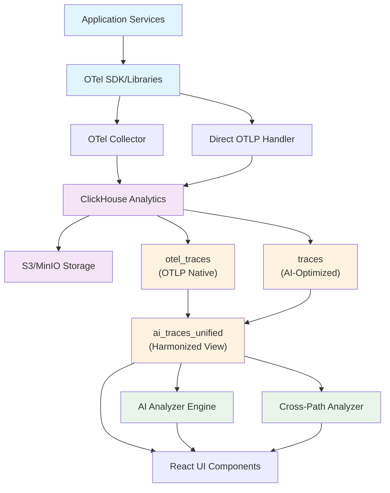

# Design Documentation

## Architecture Overview

### System Architecture - Dual Ingestion Architecture

### Dual Schema Architecture Benefits

**Key Innovation**: AI-native observability through dual ingestion paths with unified analysis.

1. **Path Isolation**: Independent validation and testing of ingestion methods
2. **Schema Optimization**: AI-optimized custom schema alongside OTLP compliance
3. **Cross-Path Analysis**: Unique insights from comparing ingestion behaviors
4. **Gradual Migration**: Transition capabilities between collector and direct paths
5. **Fault Tolerance**: Continue operations if one ingestion path fails

## Design Principles

### 1. **Zero-Cost Abstraction**

Instrumentation should have minimal overhead when disabled

### 2. **Semantic Conventions**

Follow OpenTelemetry semantic conventions strictly

### 3. **Graceful Degradation**

System continues functioning even if telemetry fails

### 4. **Configuration Over Code**

Prefer environment-based configuration

### 5. **Testability**

All instrumentation must be testable in isolation

## Key Design Areas

### Context Propagation

- W3C Trace Context as primary format
- Baggage for cross-cutting concerns
- Context injection/extraction patterns

# System Architecture

## Overview

The OpenTelemetry AI system provides robust observability for AI workloads. The architecture consists of:

- Backend storage (Clickhouse)
- Dendron documentation vault
- Instrumented packages (tracer, metrics, exporter)

## Architecture Diagram

## Data Flow

1. Instrumented packages generate telemetry data (traces, metrics, logs)
2. Data is sent directly to Clickhouse
3. Clickhouse stores and aggregates telemetry
4. Dendron documentation is updated in sync with code and telemetry changes

## Backend Storage

Clickhouse is the sole backend for telemetry data. It is optimized for high-performance analytics and OpenTelemetry semantic conventions.

- Schema optimized for OpenTelemetry semantic conventions
- Supports high-cardinality metrics and traces
- Fast aggregation and querying for AI observability

## Dendron Documentation Vault

All design decisions, package specifications, and implementation details are documented in Dendron notes. Documentation is kept in sync with code and telemetry changes.

## Instrumented Packages

- Tracer: Implements OpenTelemetry tracing with semantic conventions
- Metrics: Provides counters, histograms, and gauges
- Exporter: Handles data export to Clickhouse

## Context Propagation

Uses W3C Trace Context for distributed tracing across packages and services.

## Security & Performance

- Data is encrypted in transit
- Clickhouse backend is tuned for AI workloads
- Minimal overhead for instrumentation

## Extensibility

New packages can be added by updating Dendron notes and following documentation-driven development.
