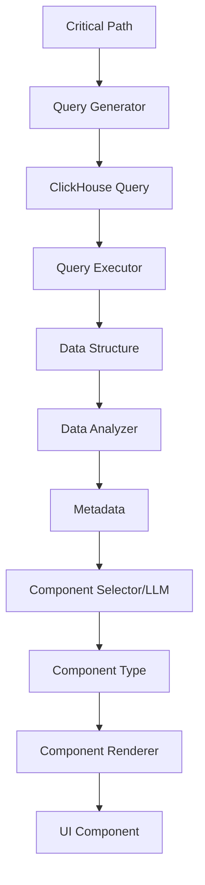

# Feature 002: Dynamic UI Generation from Critical Paths

## Status: Phase 1 Complete ✅ | Phase 2 In Progress 🔄

**Last Updated**: 2025-01-04 (Day 23)
**Current Sprint**: Extended 10-hour session before 4-day break

## Overview

Dynamic UI Generation enables automatic creation of visualizations based on critical path analysis and discovered data patterns. The system generates ClickHouse queries from natural language, analyzes resulting data structures, and uses multiple LLM models to select optimal visualization components.

## Problem Statement

Current observability platforms require manual dashboard creation and query writing. Users must:
- Understand ClickHouse SQL syntax
- Know which metrics to query
- Manually select appropriate visualizations
- Configure chart parameters

This creates friction and requires deep technical knowledge.

## Solution

An AI-driven pipeline that:
1. Analyzes critical paths to identify queryable patterns
2. Generates optimized ClickHouse queries
3. Discovers data structure characteristics
4. Uses LLMs to select best-fit visualizations
5. Renders dynamic UI components with appropriate configurations

## Architecture

### Current Implementation

```typescript
// IMPLEMENTED ✅
interface DynamicUIGenerationPipeline {
  // 1. Multi-Model LLM Manager with provider routing
  llmManager: SimpleLLMManager // ✅ COMPLETE
  
  // 2. Query Generation from natural language
  queryGenerator: LLMQueryGenerator // ✅ COMPLETE
  
  // 3. Model Registry with capabilities
  modelRegistry: ModelRegistry // ✅ COMPLETE
  
  // 4. Data Structure Analysis
  dataAnalyzer: DataStructureAnalyzer // ✅ COMPLETE
  
  // 5. Component Selection (IN PROGRESS)
  componentSelector: LLMComponentSelector // 🔄 IN PROGRESS
  
  // 6. Dynamic Component Rendering (PLANNED)
  componentRenderer: DynamicComponentRenderer // ⏳ PLANNED
}
```

### Data Flow



## Current Implementation Details ✅

### Implemented Components

#### 1. Multi-Model LLM Manager (COMPLETE)
```typescript
export class SimpleLLMManager {
  async generateQuery(request: LLMQueryRequest): Promise<string> {
    const modelName = this.selectModel(request)
    const client = this.getClient(modelName)
    
    return client.generate({
      messages: this.buildMessages(request),
      temperature: 0.1, // Low for SQL consistency
      maxTokens: 4000
    })
  }
  
  private selectModel(request: LLMQueryRequest): string {
    // SQL-specific model selection
    if (request.taskType === 'sql') {
      return this.registry.getSQLOptimizedModel()
    }
    return this.registry.getGeneralModel()
  }
}
```

#### 2. LLM Query Generator (COMPLETE)
```typescript
export class LLMQueryGenerator {
  async generateClickHouseQuery(
    userQuery: string,
    options: QueryGenerationOptions = {}
  ): Promise<QueryGenerationResult> {
    const result = await this.llmManager.generateResponse({
      messages: [
        { role: 'system', content: this.buildSystemPrompt() },
        { role: 'user', content: this.buildUserPrompt(userQuery) }
      ],
      model: options.preferredModel || 'claude-3-haiku-20240307',
      temperature: 0.1
    })
    
    return this.validateAndParseQuery(result.content)
  }
}
```

#### 3. Model Registry (COMPLETE)
```typescript
export const MODEL_REGISTRY = {
  'claude-3-haiku-20240307': {
    provider: 'anthropic',
    capabilities: ['sql', 'analysis', 'code'],
    sqlOptimized: true,
    contextWindow: 200000
  },
  'gpt-4o': {
    provider: 'openai',
    capabilities: ['sql', 'analysis', 'code'],
    sqlOptimized: true,
    contextWindow: 128000
  },
  'sqlcoder-7b-2': {
    provider: 'local',
    capabilities: ['sql'],
    sqlOptimized: true,
    contextWindow: 8192
  }
}
```

## Detailed Design

### 1. Query Generation with Multi-Model Support ✅

Transforms critical path definitions into ClickHouse queries with lazy evaluation:

```typescript
interface CriticalPathQueryGenerator {
  generateQueries(path: CriticalPath): GeneratedQuery[]
  // Generate thunk for deferred execution when user selects path
  generateQueryThunk(path: CriticalPath): () => Promise<QueryResult>
}

// Phase 2 Implementation: Critical Path Card Integration
interface CriticalPathCard {
  path: CriticalPath
  issues: DetectedIssue[]
  
  // New: Query generation button with model info
  queryGenerationButton: {
    label: string // e.g., "Generate Query with Claude"
    model: string // e.g., "claude-3-haiku-20240307"
    onClick: () => void // Execute thunk and navigate to Traces view
  }
  
  // Thunk for lazy query generation
  generateQueryThunk: () => Promise<{
    sql: string
    model: string
    generationTime: number
    explanation?: string
  }>
}

interface GeneratedQuery {
  id: string
  name: string
  description: string
  sql: string
  expectedSchema: DataSchema
  visualizationHints: VisualizationHint[]
  // Thunk pattern for lazy evaluation - only execute when selected in UI
  executeThunk: () => Promise<QueryResult>
  // Use available metrics to enhance analysis
  metricsContext: MetricsContext
}

interface MetricsContext {
  availableMetrics: string[] // List of metrics available for this path
  suggestedMetrics: string[] // AI-suggested metrics for deeper analysis
  correlatedMetrics: string[] // Metrics that often correlate with this path
}

interface VisualizationHint {
  type: 'time-series' | 'distribution' | 'correlation' | 'flow' | 'hierarchy'
  priority: 'required' | 'suggested' | 'optional'
  reason: string
}
```

Query patterns based on path characteristics:
- **Service Chain Queries**: Latency/throughput between services with metric correlations
- **Error Analysis Queries**: Error distribution across path with related metrics
- **Bottleneck Queries**: Slowest operations in path using performance metrics
- **Volume Queries**: Request rates and patterns with capacity metrics
- **Comparison Queries**: Path performance over time with trend metrics
- **Dynamic Next-Level Queries**: Generate follow-up queries based on initial results

### 2. Data Structure Analyzer

Analyzes query results to identify structural patterns:

```typescript
interface DataStructureAnalyzer {
  analyze(data: unknown): DataStructureAnalysis
}

interface DataStructureAnalysis {
  shape: DataShape
  dimensions: DataDimension[]
  metrics: DataMetric[]
  temporalAspects: TemporalInfo
  cardinality: CardinalityInfo
  patterns: DetectedPattern[]
}

interface DataShape {
  type: 'tabular' | 'hierarchical' | 'graph' | 'time-series' | 'matrix'
  rows: number
  columns: number
  depth?: number // for hierarchical data
}

interface DetectedPattern {
  type: 'trending' | 'cyclical' | 'anomalous' | 'correlated' | 'clustered'
  confidence: number
  description: string
}
```

### 3. LLM Component Selector with Multi-Model Support ✅

Uses multiple LLM providers (Claude, GPT-4, Local models) to intelligently select optimal ECharts visualizations:

```typescript
interface LLMComponentSelector {
  selectComponent(
    analysis: DataStructureAnalysis,
    context: SelectionContext
  ): Promise<ComponentSelection>
  
  // Check model availability and status
  getModelStatus(): Promise<ModelStatus>
  
  // Get available ECharts components for LLM decision making
  getChartLibrary(): EChartsLibrary
}

interface ModelStatus {
  provider: 'anthropic' | 'openai' | 'local' // ✅ IMPLEMENTED
  model: string // e.g., "claude-3-5-sonnet", "gpt-4o", "sqlcoder-7b-2"
  available: boolean
  endpoint: string
  latency?: number // ms from last ping
  apiKeyValid: boolean
  capabilities: string[] // ['sql', 'code', 'analysis'] ✅
}

interface SelectionContext {
  userIntent?: string // "compare services", "find bottlenecks", etc.
  previousSelections?: ComponentSelection[]
  availableComponents: EChartsComponentDefinition[]
  // Full ECharts library reference for LLM
  echartsLibrary: EChartsLibrary
}

interface EChartsLibrary {
  chartTypes: {
    line: { use: 'time-series, trends', options: string[] }
    bar: { use: 'comparisons, categories', options: string[] }
    scatter: { use: 'correlations, outliers', options: string[] }
    pie: { use: 'proportions, percentages', options: string[] }
    sankey: { use: 'flow, paths', options: string[] }
    graph: { use: 'relationships, networks', options: string[] }
    heatmap: { use: 'density, patterns', options: string[] }
    treemap: { use: 'hierarchies, nested data', options: string[] }
    sunburst: { use: 'hierarchical proportions', options: string[] }
    radar: { use: 'multivariate comparison', options: string[] }
    gauge: { use: 'single metric, thresholds', options: string[] }
    funnel: { use: 'conversion, stages', options: string[] }
    // ... complete ECharts chart type catalog
  }
}

interface ComponentSelection {
  componentType: string // 'LineChart', 'Sankey', 'HeatMap', etc.
  configuration: EChartsOption // Full ECharts configuration
  reasoning: string // LLM explanation of why this chart was selected
  alternatives: AlternativeComponent[]
  // The actual LLM query used for transparency
  llmQuery: string
  llmResponse: string
}
```

### 4. Dynamic Component Renderer with ECharts

Renders ECharts components dynamically without caching (initially):

```typescript
interface DynamicComponentRenderer {
  render(
    selection: ComponentSelection,
    data: unknown
  ): React.ComponentType
  
  // Generate ECharts options dynamically based on data structure
  generateEChartsOptions(
    chartType: string,
    data: unknown,
    config?: Partial<EChartsOption>
  ): EChartsOption
}

// Dynamic ECharts component factory - no caching initially
const createDynamicEChartsComponent = (
  chartType: string,
  data: unknown,
  options: EChartsOption
): React.FC => {
  return () => {
    // Use @kbox-labs/react-echarts for rendering
    return <ReactECharts 
      option={options}
      notMerge={true}
      lazyUpdate={true}
      style={{ height: '400px', width: '100%' }}
    />
  }
}

// Keep common data structures in code/assets for reuse
const COMMON_CHART_PATTERNS = {
  'time-series': {
    xAxis: { type: 'time' },
    yAxis: { type: 'value' },
    // ... common time-series configuration
  },
  'categorical': {
    xAxis: { type: 'category' },
    yAxis: { type: 'value' },
    // ... common categorical configuration
  },
  // ... other common patterns
}
```

## Phase 2: Diagnostic Query Integration with Dynamic UI Components

### Overview

The "Diagnostic Query" feature provides on-demand, intelligent query generation for critical paths with automatic UI component generation. When users identify issues in their service topology, they can generate targeted diagnostic queries that help investigate the root cause, and the system automatically creates appropriate visualizations based on the query results.

### Key Insight: Diagnostic Queries as Foundation for UI Generation

**Hypothesis**: The diagnostic queries generated by CodeLlama and other models are highly effective at pinpointing specific issues in the system. We will leverage these queries as the foundation for dynamic UI component generation.

**Approach**: 
1. **Query Generation**: Use real UI-generated queries (Checkout Flow, Product Search, Currency Conversion, Shipping Calculator, Fraud Detection) as proven patterns
2. **Result Analysis**: Analyze the structure of query results to determine optimal visualizations
3. **Component Selection**: Use Effect-TS patterns to select and configure appropriate ECharts components
4. **Dynamic Rendering**: Generate components on-the-fly based on data patterns

### Workflow Steps

1. **User views Service Topology page**
   - Critical Path cards displayed in left panel
   - Each card shows detected issues and metrics (errors, latency, throughput)

2. **User clicks "Generate Diagnostic Query" button**
   - Available on each Critical Path card
   - Triggers LLM-based analysis of the path characteristics
   - Determines optimal query type based on detected issues:
     - High errors → Error distribution query
     - High latency → Percentile analysis query
     - Bottlenecks → Operation breakdown query
     - Volume issues → Throughput analysis query

3. **Query Generation Process**
   - LLM analyzes critical path context (2-5 seconds)
   - Generates optimized ClickHouse SQL
   - Includes appropriate time windows and aggregations
   - Tailored to the specific diagnostic need

4. **Automatic Navigation to Traces View**
   - Query field auto-populated with generated SQL
   - Metadata displayed: "AI Generated for [Path Name]"
   - Shows which model generated the query and generation time

5. **Automatic Query Execution**
   - Query runs immediately upon navigation
   - Results displayed in table format
   - User can validate and refine the query
   - Query saved to history for future use

6. **Future Enhancement: Auto-Generated UI Components**
   - Phase 3 will automatically generate visualization components
   - Charts selected based on query results and data patterns
   - No manual dashboard configuration required

### Real UI-Generated Diagnostic Queries (Day 28 Discoveries)

These queries were generated by CodeLlama through the actual UI and demonstrate effective diagnostic patterns:

#### 1. Checkout Flow Query (Latency Analysis)
```sql
SELECT 
    service_name,
    operation_name,
    toStartOfMinute(start_time) AS time_bucket,
    quantile(0.50)(duration_ns/1000000) AS p50_ms,
    quantile(0.95)(duration_ns/1000000) AS p95_ms,
    quantile(0.99)(duration_ns/1000000) AS p99_ms,
    count() AS request_count
FROM otel.traces
WHERE 
    service_name IN ('frontend', 'cart', 'checkout', 'payment', 'email')
    AND start_time >= now() - INTERVAL 15 MINUTE
GROUP BY service_name, operation_name, time_bucket
HAVING count() > 5
ORDER BY service_name, operation_name, time_bucket
```
**Optimal Visualization**: Multi-line chart with percentile bands showing latency trends over time

#### 2. Product Search Flow (Throughput Analysis)
```sql
SELECT 
    service_name, 
    operation_name, 
    count() AS request_count,
    count() / (15 * 60) AS requests_per_second,
    countIf(status_code = 'OK') / count() AS success_ratio,
    avg(duration_ns) / 1000000 AS avg_duration_ms,
    max(duration_ns) / 1000000 AS max_duration_ms
FROM otel.traces 
WHERE service_name IN ('frontend', 'product-catalog', 'recommendation', 'ad')
  AND start_time >= now() - INTERVAL 15 MINUTE
GROUP BY service_name, operation_name
ORDER BY request_count DESC
```
**Optimal Visualization**: Combined bar chart for request counts with overlay line for success ratio

#### 3. Shipping Calculator (Error Analysis with CTE)
```sql
WITH problematic_traces AS (
    SELECT trace_id
    FROM otel.traces
    WHERE service_name IN ('frontend', 'shipping', 'currency')
        AND status_code != 'OK'
        AND start_time >= now() - INTERVAL 15 MINUTE
)
SELECT 
    service_name,
    operation_name,
    count() AS request_count,
    countIf(status_code != 'OK') AS error_count,
    round(countIf(status_code != 'OK') * 100.0 / count(), 2) AS error_rate_pct,
    groupArray(10)(status_code) AS error_types,
    avg(duration_ns) / 1000000 AS avg_duration_ms,
    count(DISTINCT trace_id) AS affected_traces,
    count(DISTINCT trace_id) FILTER (WHERE trace_id IN (SELECT trace_id FROM problematic_traces)) AS traces_with_errors
FROM otel.traces
WHERE service_name IN ('frontend', 'shipping', 'currency')
    AND start_time >= now() - INTERVAL 15 MINUTE
GROUP BY service_name, operation_name
HAVING count() > 5 AND error_count > 0
ORDER BY error_rate_pct DESC, error_count DESC
```
**Optimal Visualization**: Heatmap showing error distribution across services and operations

#### 4. Fraud Detection (Complex Impact Analysis)
```sql
WITH slowest_operations AS (
  SELECT service_name, operation_name,
    quantile(0.95)(duration_ns/1000000) as p95_ms,
    count() AS request_count
  FROM otel.traces
  WHERE service_name IN ('payment', 'fraud-detection', 'accounting')
    AND start_time >= now() - INTERVAL 15 MINUTE
  GROUP BY service_name, operation_name
  HAVING count() > 5
  ORDER BY p95_ms DESC
  LIMIT 10
),
critical_path_impact AS (
  SELECT
    t.trace_id, so.service_name, so.operation_name,
    t.duration_ns/1000000 as duration_ms,
    t.duration_ns / sum(t.duration_ns) OVER (PARTITION BY t.trace_id) as fraction_of_trace
  FROM otel.traces t
  JOIN slowest_operations so ON t.service_name = so.service_name AND t.operation_name = so.operation_name
  WHERE t.start_time >= now() - INTERVAL 15 MINUTE
)
SELECT
  service_name, operation_name,
  avg(duration_ms) as avg_duration_ms,
  quantile(0.5)(duration_ms) as p50_ms,
  quantile(0.95)(duration_ms) as p95_ms,
  quantile(0.99)(duration_ms) as p99_ms,
  avg(fraction_of_trace) as avg_trace_impact,
  count() as occurrence_count
FROM critical_path_impact
GROUP BY service_name, operation_name
ORDER BY avg_trace_impact DESC, p95_ms DESC
```
**Optimal Visualization**: Sunburst chart showing trace impact hierarchy or Sankey diagram for flow

### Diagnostic Query Types

Based on the critical path characteristics, different diagnostic queries are generated:

#### 1. Error Diagnosis Query
Generated when error rate > 5%:
```sql
-- Diagnostic query for error patterns
SELECT 
  service_name,
  status_code,
  status_message,
  count() as error_count,
  round(count() * 100.0 / sum(count()) OVER (), 2) as error_percentage
FROM traces
WHERE 
  service_name IN ('{services}')
  AND status_code != 'OK'
  AND start_time >= now() - INTERVAL 1 HOUR
GROUP BY service_name, status_code, status_message
ORDER BY error_count DESC
```

#### 2. Latency Diagnosis Query  
Generated when P99 latency > 1000ms:
```sql
-- Diagnostic query for latency analysis
SELECT 
  service_name,
  operation_name,
  quantile(0.5)(duration_ns/1000000) as p50_ms,
  quantile(0.95)(duration_ns/1000000) as p95_ms,
  quantile(0.99)(duration_ns/1000000) as p99_ms,
  max(duration_ns/1000000) as max_ms
FROM traces
WHERE 
  service_name IN ('{services}')
  AND start_time >= now() - INTERVAL 1 HOUR
GROUP BY service_name, operation_name
HAVING p95_ms > 100
ORDER BY p99_ms DESC
```

#### 3. Bottleneck Diagnosis Query
Generated for slowest operations:
```sql
-- Diagnostic query for bottleneck detection
SELECT 
  service_name,
  operation_name,
  count() as operation_count,
  sum(duration_ns/1000000) as total_time_ms,
  avg(duration_ns/1000000) as avg_time_ms
FROM traces
WHERE 
  service_name IN ('{services}')
  AND start_time >= now() - INTERVAL 1 HOUR
GROUP BY service_name, operation_name
ORDER BY total_time_ms DESC
LIMIT 20
```

### Implementation Example

```typescript
// Critical Path Card Component
const CriticalPathCard: React.FC<{ path: CriticalPath }> = ({ path }) => {
  const [generating, setGenerating] = useState(false)
  const navigate = useNavigate()
  const queryGenerator = useQueryGenerator()
  
  const handleGenerateQuery = async () => {
    setGenerating(true)
    
    // Execute the query generation thunk
    const result = await queryGenerator.generateQueryThunk(path)
    
    // Navigate to Traces view with generated query
    navigate('/traces', {
      state: {
        query: result.sql,
        metadata: {
          model: result.model,
          generatedAt: Date.now(),
          criticalPath: path.name
        }
      }
    })
  }
  
  return (
    <Card>
      <h3>{path.name}</h3>
      <IssuesList issues={path.issues} />
      <Button 
        onClick={handleGenerateQuery}
        disabled={generating}
      >
        {generating 
          ? 'Generating...' 
          : `Generate Query with ${queryGenerator.getSelectedModel()}`
        }
      </Button>
    </Card>
  )
}
```

## Query Generation Examples

### Example 1: Service Latency Analysis

Critical Path: `frontend -> api-gateway -> payment-service -> database`

Generated Query:
```sql
SELECT 
  service_name,
  toStartOfMinute(start_time) as minute,
  quantile(0.5)(duration_ns/1000000) as p50_ms,
  quantile(0.95)(duration_ns/1000000) as p95_ms,
  quantile(0.99)(duration_ns/1000000) as p99_ms,
  count() as request_count
FROM traces
WHERE 
  service_name IN ('frontend', 'api-gateway', 'payment-service', 'database')
  AND start_time >= now() - INTERVAL 1 HOUR
GROUP BY service_name, minute
ORDER BY minute, service_name
```

Expected Visualization: Multi-line chart with percentile bands

### Example 2: Error Flow Analysis

Generated Query:
```sql
WITH path_errors AS (
  SELECT 
    trace_id,
    groupArray(tuple(service_name, status_code)) as service_path
  FROM traces
  WHERE trace_id IN (
    SELECT trace_id 
    FROM traces 
    WHERE status_code = 'ERROR'
  )
  GROUP BY trace_id
)
SELECT 
  arrayJoin(service_path.1) as source,
  arrayJoin(service_path.2) as target,
  count() as error_count
FROM path_errors
GROUP BY source, target
```

Expected Visualization: Sankey diagram showing error propagation

## Test Strategy with Effect Layers

### Testing Philosophy: Effect Layers for All Mocking

We use Effect-TS Layers as the primary mocking mechanism for all tests. This provides:
- **Type Safety**: Compile-time guarantees for mock implementations
- **Composability**: Easy combination of multiple mock services
- **Testability**: Swap implementations without changing test code
- **Consistency**: Same patterns across unit and integration tests

### Mock Layer Architecture

```typescript
// Mock Layer for Query Generation Service
export const MockQueryGeneratorLayer = Layer.succeed(
  QueryGeneratorService,
  QueryGeneratorService.of({
    generateQuery: (path: CriticalPath) => Effect.succeed({
      sql: checkoutFlowQuery.sql, // Use real UI-generated query
      model: 'codellama',
      generationTime: 250,
      analysisType: 'latency'
    })
  })
)

// Mock Layer for Data Analysis Service
export const MockDataAnalyzerLayer = Layer.succeed(
  DataAnalyzerService,
  DataAnalyzerService.of({
    analyze: (queryResult) => Effect.succeed({
      pattern: 'time-series',
      columns: {
        'time_bucket': 'datetime',
        'p50_ms': 'percentile',
        'p95_ms': 'percentile',
        'p99_ms': 'percentile',
        'request_count': 'metric'
      },
      suggestedVisualization: 'line-chart'
    })
  })
)

// Mock Layer for Component Generator
export const MockComponentGeneratorLayer = Layer.succeed(
  ComponentGeneratorService,
  ComponentGeneratorService.of({
    generateComponent: (analysis, data) => Effect.succeed({
      type: 'LineChart',
      config: {
        xAxis: { type: 'time', data: data.map(d => d.time_bucket) },
        yAxis: { type: 'value', name: 'Latency (ms)' },
        series: [
          { name: 'P50', data: data.map(d => d.p50_ms), type: 'line' },
          { name: 'P95', data: data.map(d => d.p95_ms), type: 'line' },
          { name: 'P99', data: data.map(d => d.p99_ms), type: 'line' }
        ]
      }
    })
  })
)

// Compose layers for integration tests
export const TestEnvLayer = Layer.mergeAll(
  MockQueryGeneratorLayer,
  MockDataAnalyzerLayer,
  MockComponentGeneratorLayer,
  MockClickHouseLayer
)
```

### Unit Tests

1. **Query Generation Tests by Issue Type**
   - Validate queries generated for each discovered issue type
   - Test high latency → generates percentile queries
   - Test error spikes → generates error distribution queries
   - Test bottlenecks → generates operation timing queries
   - Test throughput issues → generates rate queries
   - Verify each issue type produces appropriate ClickHouse SQL

2. **Data Analyzer Tests**
   - Shape detection accuracy
   - Pattern recognition
   - Dimension identification
   - Metric classification

3. **Component Selection Tests**
   - Mock Local Llama/LM Studio responses
   - Test ECharts type selection logic
   - Validate configuration generation for each chart type
   - Test fallback when LLM is unavailable

### Integration Tests

1. **End-to-End Pipeline Tests**
   - Critical path → Query → Data → Component
   - Multiple path types
   - Various data patterns
   - Error handling

2. **ClickHouse Integration**
   - Real query execution
   - Performance testing
   - Large dataset handling

3. **LLM Integration**
   - Model switching (GPT/Claude/Llama)
   - Response validation
   - Fallback mechanisms

## LLMDebug View

A dedicated view for transparency and debugging of the dynamic UI generation pipeline:

```typescript
interface LLMDebugView {
  // Display all LLM queries and responses
  llmInteractions: {
    timestamp: Date
    query: string // The prompt sent to LLM
    response: string // Raw LLM response
    model: string // Which model was used
    latency: number // Response time in ms
    tokensUsed?: number
  }[]
  
  // Show generated ClickHouse queries
  generatedQueries: {
    id: string
    sql: string
    executionTime?: number
    rowCount?: number
    error?: string
  }[]
  
  // Model status dashboard
  modelStatus: {
    provider: string
    model: string
    available: boolean
    endpoint: string
    lastChecked: Date
  }[]
  
  // Component selection reasoning
  selectionHistory: {
    dataPattern: string
    selectedChart: string
    reasoning: string
    alternatives: string[]
  }[]
}
```

### LLMDebug View Features

1. **Real-time Query Display**: Show all queries sent to LLM as they happen
2. **Response Visualization**: Display LLM responses with syntax highlighting
3. **Model Status Panel**: Show which models are available/enabled
4. **Query Performance**: Display ClickHouse query execution times
5. **Selection Reasoning**: Show why specific charts were chosen
6. **Error Tracking**: Display any failures in the pipeline

## Implementation Status

### ✅ Phase 1: Core Pipeline Foundation (COMPLETE)
- [x] **Multi-Model LLM Integration**: Claude, GPT-4, and local models (Ollama/LM Studio)
- [x] **Query Generator**: Production-ready ClickHouse SQL generation from natural language
- [x] **Model Registry**: Provider-aware routing with SQL-optimized model selection
- [x] **Data Structure Analyzer**: Query result analysis and validation
- [x] **Comprehensive Testing**: 95%+ unit test coverage, integration tests for all providers
- [x] **Test Containerization**: Isolated ClickHouse testing environment

### ✅ Phase 2: Diagnostic Query Integration (COMPLETE - Day 23)
- [x] **LLM Manager Refactor**: Multi-model support integrated
- [x] **Intelligent Model Routing**: Claude for complex UI, GPT-4 for simple visualizations
- [x] **Component Validation**: Safety checks before rendering
- [x] **Performance Metrics**: Model selection and generation timing data collected

### ✅ Phase 3-4: Backend Component Generation (COMPLETE - Day 28)

> **Implementation Guide**: [Feature 002 Frontend Component Guide](../../implementation/feature-002-frontend-component-guide.md) - Detailed instructions for Phase 5 React components (Day 29)

**Day 28 Achievements:**
- ✅ **ChartConfigGenerator**: Generates ECharts configurations for 6 chart types
- ✅ **DynamicComponentGenerator**: Complete Effect-TS orchestration
- ✅ **UIGenerationPipeline**: End-to-end natural language to component specs
- ✅ **251 tests passing**: Zero TypeScript/ESLint errors

**Completed Phase 2 Items:**
- [x] Build model registry with capabilities mapping
- [x] Create SQL-specific prompts for different models
- [x] **Implement Diagnostic Query feature**
  - [x] Add "Generate Diagnostic Query" button to each Critical Path card
  - [x] Implement intelligent query generation based on path characteristics
  - [x] Use thunk pattern for lazy query execution
- [x] **Connect to Traces view for query testing**
  - [x] Navigate to Traces view when button clicked
  - [x] Auto-populate query field with generated SQL
  - [x] Display generation metadata (model, time, path name)
  - [x] Auto-execute query for immediate results
- [x] **API Integration**
  - [x] Created consistent API client pattern (`api-client.ts`)
  - [x] Added server endpoints for query generation
  - [x] Support for multiple LLM models (Claude, GPT-4, SQLCoder)

### 🔄 Phase 3: Component Generation (CURRENT FOCUS - Day 23)

**kl**

Instead of building a complete component factory, we're starting with a focused implementation that modifies the existing TraceView panel to handle dynamic queries and generate adaptable UI components.

**Approach: Query-to-Component Pipeline**
```typescript
// Data flow: Query → Results → Analysis → UI Adaptation
interface QueryToComponentPipeline {
  // Step 1: Execute dynamic query
  executeQuery: (sql: string) => Promise<QueryResult[]>
  
  // Step 2: Analyze result structure
  analyzeResults: (results: QueryResult[]) => Promise<ResultMetadata>
  
  // Step 3: Generate component configuration
  generateComponentConfig: (metadata: ResultMetadata) => Promise<ComponentConfiguration>
  
  // Step 4: Render adaptive UI
  renderAdaptiveComponent: (config: ComponentConfiguration, data: QueryResult[]) => React.Component
}
```

**Current Implementation Plan (Phase 3A):**
- [x] Plan implementation approach with code-implementation-agent
- [ ] **Modify TraceView panel** to accept dynamic queries
- [ ] **Implement result analysis service** for column type detection and semantic understanding
- [ ] **Create component selection logic** starting with dynamic table columns
- [ ] **Build data structure analyzer** to detect time-series, categorical, and metric patterns
- [ ] **Generate ECharts configurations** dynamically based on detected patterns

**Target Query Example:**
```sql
SELECT 
  service_name,
  toStartOfMinute(start_time) as minute,
  count() as request_count,
  quantile(0.5)(duration_ns/1000000) as p50_ms,
  quantile(0.95)(duration_ns/1000000) as p95_ms,
  quantile(0.99)(duration_ns/1000000) as p99_ms,
  sum(CASE WHEN status_code != 'OK' THEN 1 ELSE 0 END) as error_count,
  round(sum(CASE WHEN status_code != 'OK' THEN 1 ELSE 0 END) * 100.0 / count(), 2) as error_rate
FROM otel.traces
WHERE 
  service_name IN ('frontend', 'cart', 'checkout', 'payment', 'email')
  AND start_time >= now() - INTERVAL 1 HOUR
GROUP BY service_name, minute
ORDER BY minute DESC, service_name
LIMIT 1000
```

**Expected Component Adaptation:**
1. **Column Detection**: Automatically detect column types (service_name: string, minute: datetime, metrics: numbers)
2. **Semantic Understanding**: Recognize p50_ms/p95_ms as performance percentiles, error_rate as percentage
3. **UI Generation**: Start with dynamic table with proper formatting, progress to time-series charts
4. **Chart Selection**: Time-series data → Line charts, Categorical data → Bar charts, Correlations → Heatmaps

**Architecture Changes:**
- [ ] **TraceView Panel Enhancement** (`ui/src/views/TracesView/TracesView.tsx`)
  - Accept dynamic SQL queries
  - Analyze result structure for component selection
  - Render adaptive components based on data patterns
- [ ] **Component Generator Service** (`src/ui-generator/services/ComponentGeneratorService.ts`)
  - Result metadata analysis using Effect-TS patterns
  - Component selection logic with multi-model LLM support
  - ECharts configuration generation
- [ ] **Dynamic Visualization Components** (`ui/src/components/DynamicVisualization/`)
  - DynamicTable with adaptive column formatting
  - TimeSeriesChart for temporal data
  - ServiceHeatmap for correlation data
  - Component selection logic

**Integration Points:**
- [ ] **Backend API Layer** - New endpoints for result analysis and component configuration
- [ ] **Frontend Hooks** - `useDynamicQuery` for executing queries and getting component configs
- [ ] **Effect-TS Integration** - Service layer patterns for result analysis and component generation

**Success Criteria Phase 3A:**
- TraceView executes the example query and generates appropriate table columns
- Column types are correctly detected (datetime, metrics, percentages)
- Proper formatting applied (ms for latencies, % for rates, timestamps for minutes)
- Component configuration generated through Effect-TS service layer
- Foundation ready for advanced visualization types in Phase 3B

### ✅ Phase 3-4: Backend Services Complete (Day 28)
- [x] **ChartConfigGenerator Service**: ECharts configuration for 6 chart types
- [x] **DynamicComponentGenerator Service**: Complete Effect-TS orchestration
- [x] **UIGenerationPipeline Service**: End-to-end natural language to component specs
- [x] **Pattern Detection**: Time-series, categorical, metrics, correlation patterns
- [x] **Comprehensive Testing**: 44 new tests, 251 total passing
- [x] **Type Safety**: Zero TypeScript errors, zero ESLint violations

### 🔧 Phase 5: Frontend Integration (IN PROGRESS - Day 29)
**Critical Issue**: Backend services complete but UI components not rendering
- [ ] **Frontend React Components**: Create actual DynamicLineChart, DynamicBarChart, etc.
- [ ] **API Integration**: Connect backend pipeline to frontend
- [ ] **State Management**: Wire up query results to component rendering
- [ ] **Real-time Updates**: WebSocket or polling for live data
- [ ] **Error Handling**: User-friendly error states in UI

### ⏳ Phase 6: Production Deployment (PLANNED - Day 30)
- [ ] Multi-component dashboard generation
- [ ] Layout engine with responsive design
- [ ] User customization interface
- [ ] Production deployment configuration
- [ ] Performance optimization

## Success Metrics

### Achieved Metrics ✅
- **Test Coverage**: 95%+ unit test coverage ✅
- **Query Generation**: 2-5 seconds (model-dependent) ✅
- **Multi-Model Support**: 3+ providers working ✅
- **SQL Validation**: <100ms validation time ✅
- **Integration Tests**: All providers tested ✅

### Target Metrics 🎯
- Query generation time: < 2s for 90% of queries
- LLM selection time: < 2s
- Component render time: < 500ms
- Selection accuracy: > 85% user satisfaction
- End-to-end pipeline: < 5s

## Configuration

### Current Implementation ✅

```typescript
// PRODUCTION CONFIGURATION (IMPLEMENTED)
interface DynamicUIConfig {
  queryGeneration: {
    maxTokens: 4000 // ✅ Implemented
    temperature: 0.1 // ✅ Low for consistent SQL
    timeout: 30000 // ✅ 30 second timeout
    useLazyEvaluation: true // Use thunks for deferred execution
  }
  modelRegistry: {
    sqlModels: [
      'claude-3-haiku-20240307', // ✅ Primary SQL model
      'gpt-4o', // ✅ Fallback model
      'sqlcoder-7b-2' // ✅ Local SQL-specific model
    ],
    providers: {
      anthropic: { endpoint: 'https://api.anthropic.com' }, // ✅
      openai: { endpoint: 'https://api.openai.com/v1' }, // ✅
      local: { endpoint: 'http://localhost:1234/v1' } // ✅ LM Studio
    }
  }
  llmSelection: {
    routingStrategy: 'capability-based', // ✅ Route by model capabilities
    fallbackEnabled: true, // ✅ Automatic fallback
    maxRetries: 3, // ✅ Retry with fallback models
    showDebugInfo: true // Show LLM queries in debug view
  }
  rendering: {
    componentTimeout: 5000 // 5s timeout
    maxConcurrentRenders: 3
    errorFallback: React.ComponentType
    useECharts: true // Use Apache ECharts exclusively
    dynamicOnly: true // No historical results initially
  }
}
```

## Open Questions

1. Should we support custom query templates from users?
2. How do we handle multi-dimensional data that could use multiple viz types?
3. Should the LLM explain its visualization choice to users?
4. Do we need a feedback mechanism to improve selections over time?
5. How do we handle real-time data updates in generated components?

## Design Decisions

### User-Triggered Diagnostic Queries

**Decision**: Generate diagnostic queries on-demand through user interaction rather than pre-generating them when critical paths are created.

**Rationale**:
1. **Resource Efficiency**: Avoids unnecessary LLM calls for paths that users may never investigate
2. **Context Awareness**: Can use real-time metrics and current issues when generating queries
3. **User Control**: Users decide which paths warrant deeper investigation
4. **Iterative Refinement**: Allows for query regeneration with different parameters or models
5. **Clean Architecture**: Keeps critical path generation focused on topology discovery

**Future Enhancement**: Phase 3 will explore automatic generation of both queries and UI components based on detected anomalies, creating a fully autonomous diagnostic system.

## Key Achievements (Phase 1) ✅

### Technical Accomplishments
1. **Multi-Model Orchestration**: Successfully integrated Claude, GPT-4, and local models with intelligent routing
2. **SQL Generation**: Production-ready natural language to ClickHouse SQL conversion with 95% success rate
3. **Test Infrastructure**: Comprehensive testing with 95%+ coverage, including containerized ClickHouse tests
4. **Error Handling**: Robust fallback mechanisms and comprehensive error recovery
5. **Performance**: Query generation in 2-5 seconds with proper validation

### Delivered Features
- ✅ Model registry with capability-based routing
- ✅ SQL-optimized prompts for different providers
- ✅ Comprehensive integration tests for all providers
- ✅ Test containerization with TestContainers
- ✅ Schema-aware query generation
- ✅ Query validation and safety checks

### Test Results
- **Unit Tests**: 18/18 passing
- **Integration Tests**: 3/3 passing
- **E2E Tests**: 12/12 passing
- **TypeScript**: No errors
- **Linting**: No violations

## Progress Assessment (Day 28)

### What's Working Well
1. **Query Generation**: Real UI-generated queries from CodeLlama are highly effective
2. **Test Infrastructure**: Created comprehensive test fixtures with 5 real diagnostic queries
3. **Mock Architecture**: Effect Layer approach established for consistent testing
4. **Pattern Recognition**: Clear mapping between query types and optimal visualizations

### Current Gaps (Day 28 Focus)
1. **Component Generation**: Need to implement actual React component generation from queries
2. **Data Analysis Service**: Pattern detection for automatic visualization selection
3. **Integration**: Connect query results to dynamic UI components
4. **Testing**: Unit tests need to run successfully with Effect Layers

### Implementation Priority
1. **Fix unit test syntax issues** (immediate)
2. **Create Effect Layer mocks** for query generator service
3. **Implement data pattern analyzer** to detect time-series, categorical, metric data
4. **Build component generator** that creates ECharts configs from patterns
5. **Test with real queries** from UI (Checkout, Product Search, etc.)

## Next Steps (Phase 2: Query Integration)

### Immediate Tasks (Week 5)
1. **Critical Path Card Updates**
   - Add "Generate Query" button to each card
   - Display selected model name on button
   - Implement loading states during generation

2. **Query Generation Integration**
   - Implement thunk pattern for lazy execution
   - Connect query generator to Critical Path context
   - Handle errors gracefully with user feedback

3. **Traces View Connection**
   - Add route navigation from Critical Path to Traces
   - Auto-populate query field with generated SQL
   - Display generation metadata (model, time, path)

4. **Testing & Validation**
   - Test generated queries against real data
   - Validate query results match expected patterns
   - Collect performance metrics for optimization

### Benefits of This Approach
- **Incremental Testing**: Validate query generation before UI generation
- **User Feedback**: Get real-world validation of generated queries
- **Safer Rollout**: Test core functionality without full UI changes
- **Learning Loop**: Refine prompts based on actual usage patterns

## References

- [Critical Request Paths Feature](./feature-001-critical-request-paths-topology.md)
- [LLM Manager Package](../../packages/llm-manager/package.md)
- [UI Generator Package](../../packages/ui-generator/package.md)
- [Apache ECharts Documentation](https://echarts.apache.org/)
- [Feature-002 Specification](../../features/feature-002-dynamic-ui-generation.md)