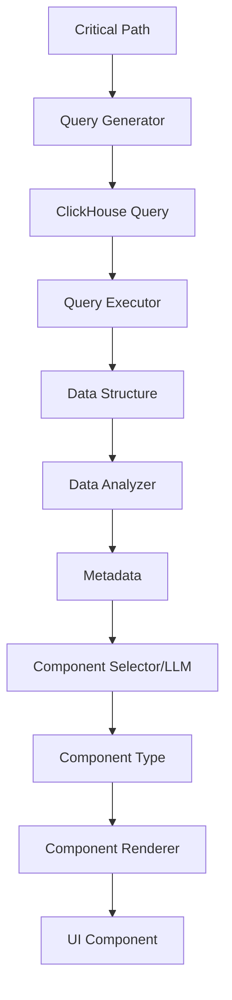

# Feature 002: Dynamic UI Generation from Critical Paths

## Overview

Dynamic UI Generation enables automatic creation of visualizations based on critical path analysis and discovered data patterns. The system generates ClickHouse queries from critical paths, analyzes resulting data structures, and uses LLMs to select optimal visualization components.

## Problem Statement

Current observability platforms require manual dashboard creation and query writing. Users must:
- Understand ClickHouse SQL syntax
- Know which metrics to query
- Manually select appropriate visualizations
- Configure chart parameters

This creates friction and requires deep technical knowledge.

## Solution

An AI-driven pipeline that:
1. Analyzes critical paths to identify queryable patterns
2. Generates optimized ClickHouse queries
3. Discovers data structure characteristics
4. Uses LLMs to select best-fit visualizations
5. Renders dynamic UI components with appropriate configurations

## Architecture

### Components

```typescript
interface DynamicUIGenerationPipeline {
  // 1. Query Generation from Critical Paths
  queryGenerator: CriticalPathQueryGenerator
  
  // 2. Query Execution & Data Retrieval
  queryExecutor: ClickHouseQueryExecutor
  
  // 3. Data Structure Analysis
  dataAnalyzer: DataStructureAnalyzer
  
  // 4. LLM-based Component Selection
  componentSelector: LLMComponentSelector
  
  // 5. Dynamic Component Rendering
  componentRenderer: DynamicComponentRenderer
}
```

### Data Flow



## Detailed Design

### 1. Critical Path Query Generator with Dynamic Execution

Transforms critical path definitions into ClickHouse queries with lazy evaluation:

```typescript
interface CriticalPathQueryGenerator {
  generateQueries(path: CriticalPath): GeneratedQuery[]
  // Generate thunk for deferred execution when user selects path
  generateQueryThunk(path: CriticalPath): () => Promise<QueryResult>
}

interface GeneratedQuery {
  id: string
  name: string
  description: string
  sql: string
  expectedSchema: DataSchema
  visualizationHints: VisualizationHint[]
  // Thunk pattern for lazy evaluation - only execute when selected in UI
  executeThunk: () => Promise<QueryResult>
  // Use available metrics to enhance analysis
  metricsContext: MetricsContext
}

interface MetricsContext {
  availableMetrics: string[] // List of metrics available for this path
  suggestedMetrics: string[] // AI-suggested metrics for deeper analysis
  correlatedMetrics: string[] // Metrics that often correlate with this path
}

interface VisualizationHint {
  type: 'time-series' | 'distribution' | 'correlation' | 'flow' | 'hierarchy'
  priority: 'required' | 'suggested' | 'optional'
  reason: string
}
```

Query patterns based on path characteristics:
- **Service Chain Queries**: Latency/throughput between services with metric correlations
- **Error Analysis Queries**: Error distribution across path with related metrics
- **Bottleneck Queries**: Slowest operations in path using performance metrics
- **Volume Queries**: Request rates and patterns with capacity metrics
- **Comparison Queries**: Path performance over time with trend metrics
- **Dynamic Next-Level Queries**: Generate follow-up queries based on initial results

### 2. Data Structure Analyzer

Analyzes query results to identify structural patterns:

```typescript
interface DataStructureAnalyzer {
  analyze(data: unknown): DataStructureAnalysis
}

interface DataStructureAnalysis {
  shape: DataShape
  dimensions: DataDimension[]
  metrics: DataMetric[]
  temporalAspects: TemporalInfo
  cardinality: CardinalityInfo
  patterns: DetectedPattern[]
}

interface DataShape {
  type: 'tabular' | 'hierarchical' | 'graph' | 'time-series' | 'matrix'
  rows: number
  columns: number
  depth?: number // for hierarchical data
}

interface DetectedPattern {
  type: 'trending' | 'cyclical' | 'anomalous' | 'correlated' | 'clustered'
  confidence: number
  description: string
}
```

### 3. LLM Component Selector with ECharts Library

Uses Local Llama (via LM Studio) to intelligently select optimal ECharts visualizations:

```typescript
interface LLMComponentSelector {
  selectComponent(
    analysis: DataStructureAnalysis,
    context: SelectionContext
  ): Promise<ComponentSelection>
  
  // Check model availability and status
  getModelStatus(): Promise<ModelStatus>
  
  // Get available ECharts components for LLM decision making
  getChartLibrary(): EChartsLibrary
}

interface ModelStatus {
  provider: 'lm-studio' | 'openai' | 'claude'
  model: string // e.g., "gpt-oss-20b" for LM Studio
  available: boolean
  endpoint: string
  latency?: number // ms from last ping
  apiKeyValid: boolean
}

interface SelectionContext {
  userIntent?: string // "compare services", "find bottlenecks", etc.
  previousSelections?: ComponentSelection[]
  availableComponents: EChartsComponentDefinition[]
  // Full ECharts library reference for LLM
  echartsLibrary: EChartsLibrary
}

interface EChartsLibrary {
  chartTypes: {
    line: { use: 'time-series, trends', options: string[] }
    bar: { use: 'comparisons, categories', options: string[] }
    scatter: { use: 'correlations, outliers', options: string[] }
    pie: { use: 'proportions, percentages', options: string[] }
    sankey: { use: 'flow, paths', options: string[] }
    graph: { use: 'relationships, networks', options: string[] }
    heatmap: { use: 'density, patterns', options: string[] }
    treemap: { use: 'hierarchies, nested data', options: string[] }
    sunburst: { use: 'hierarchical proportions', options: string[] }
    radar: { use: 'multivariate comparison', options: string[] }
    gauge: { use: 'single metric, thresholds', options: string[] }
    funnel: { use: 'conversion, stages', options: string[] }
    // ... complete ECharts chart type catalog
  }
}

interface ComponentSelection {
  componentType: string // 'LineChart', 'Sankey', 'HeatMap', etc.
  configuration: EChartsOption // Full ECharts configuration
  reasoning: string // LLM explanation of why this chart was selected
  alternatives: AlternativeComponent[]
  // The actual LLM query used for transparency
  llmQuery: string
  llmResponse: string
}
```

### 4. Dynamic Component Renderer with ECharts

Renders ECharts components dynamically without caching (initially):

```typescript
interface DynamicComponentRenderer {
  render(
    selection: ComponentSelection,
    data: unknown
  ): React.ComponentType
  
  // Generate ECharts options dynamically based on data structure
  generateEChartsOptions(
    chartType: string,
    data: unknown,
    config?: Partial<EChartsOption>
  ): EChartsOption
}

// Dynamic ECharts component factory - no caching initially
const createDynamicEChartsComponent = (
  chartType: string,
  data: unknown,
  options: EChartsOption
): React.FC => {
  return () => {
    // Use @kbox-labs/react-echarts for rendering
    return <ReactECharts 
      option={options}
      notMerge={true}
      lazyUpdate={true}
      style={{ height: '400px', width: '100%' }}
    />
  }
}

// Keep common data structures in code/assets for reuse
const COMMON_CHART_PATTERNS = {
  'time-series': {
    xAxis: { type: 'time' },
    yAxis: { type: 'value' },
    // ... common time-series configuration
  },
  'categorical': {
    xAxis: { type: 'category' },
    yAxis: { type: 'value' },
    // ... common categorical configuration
  },
  // ... other common patterns
}
```

## Query Generation Examples

### Example 1: Service Latency Analysis

Critical Path: `frontend -> api-gateway -> payment-service -> database`

Generated Query:
```sql
SELECT 
  service_name,
  toStartOfMinute(start_time) as minute,
  quantile(0.5)(duration_ns/1000000) as p50_ms,
  quantile(0.95)(duration_ns/1000000) as p95_ms,
  quantile(0.99)(duration_ns/1000000) as p99_ms,
  count() as request_count
FROM traces
WHERE 
  service_name IN ('frontend', 'api-gateway', 'payment-service', 'database')
  AND start_time >= now() - INTERVAL 1 HOUR
GROUP BY service_name, minute
ORDER BY minute, service_name
```

Expected Visualization: Multi-line chart with percentile bands

### Example 2: Error Flow Analysis

Generated Query:
```sql
WITH path_errors AS (
  SELECT 
    trace_id,
    groupArray(tuple(service_name, status_code)) as service_path
  FROM traces
  WHERE trace_id IN (
    SELECT trace_id 
    FROM traces 
    WHERE status_code = 'ERROR'
  )
  GROUP BY trace_id
)
SELECT 
  arrayJoin(service_path.1) as source,
  arrayJoin(service_path.2) as target,
  count() as error_count
FROM path_errors
GROUP BY source, target
```

Expected Visualization: Sankey diagram showing error propagation

## Test Strategy

### Unit Tests

1. **Query Generation Tests by Issue Type**
   - Validate queries generated for each discovered issue type
   - Test high latency → generates percentile queries
   - Test error spikes → generates error distribution queries
   - Test bottlenecks → generates operation timing queries
   - Test throughput issues → generates rate queries
   - Verify each issue type produces appropriate ClickHouse SQL

2. **Data Analyzer Tests**
   - Shape detection accuracy
   - Pattern recognition
   - Dimension identification
   - Metric classification

3. **Component Selection Tests**
   - Mock Local Llama/LM Studio responses
   - Test ECharts type selection logic
   - Validate configuration generation for each chart type
   - Test fallback when LLM is unavailable

### Integration Tests

1. **End-to-End Pipeline Tests**
   - Critical path → Query → Data → Component
   - Multiple path types
   - Various data patterns
   - Error handling

2. **ClickHouse Integration**
   - Real query execution
   - Performance testing
   - Large dataset handling

3. **LLM Integration**
   - Model switching (GPT/Claude/Llama)
   - Response validation
   - Fallback mechanisms

## LLMDebug View

A dedicated view for transparency and debugging of the dynamic UI generation pipeline:

```typescript
interface LLMDebugView {
  // Display all LLM queries and responses
  llmInteractions: {
    timestamp: Date
    query: string // The prompt sent to LLM
    response: string // Raw LLM response
    model: string // Which model was used
    latency: number // Response time in ms
    tokensUsed?: number
  }[]
  
  // Show generated ClickHouse queries
  generatedQueries: {
    id: string
    sql: string
    executionTime?: number
    rowCount?: number
    error?: string
  }[]
  
  // Model status dashboard
  modelStatus: {
    provider: string
    model: string
    available: boolean
    endpoint: string
    lastChecked: Date
  }[]
  
  // Component selection reasoning
  selectionHistory: {
    dataPattern: string
    selectedChart: string
    reasoning: string
    alternatives: string[]
  }[]
}
```

### LLMDebug View Features

1. **Real-time Query Display**: Show all queries sent to LLM as they happen
2. **Response Visualization**: Display LLM responses with syntax highlighting
3. **Model Status Panel**: Show which models are available/enabled
4. **Query Performance**: Display ClickHouse query execution times
5. **Selection Reasoning**: Show why specific charts were chosen
6. **Error Tracking**: Display any failures in the pipeline

## Implementation Plan

### Phase 1: Core Pipeline with LM Studio Integration
- [ ] Connect to Local Llama via LM Studio (openai/gpt-oss-20b)
- [ ] Create query generator with thunk pattern for lazy execution
- [ ] Implement data structure analyzer
- [ ] Build LLMDebug View for transparency
- [ ] Write query generation tests by issue type

### Phase 2: ECharts Integration
- [ ] Build complete ECharts library reference for LLM
- [ ] Create dynamic ECharts component factory
- [ ] Implement component selection with Local Llama
- [ ] Add model status checking and display

### Phase 3: UI Components
- [ ] Build LLMDebug View with query/response display
- [ ] Create dynamic renderer without initial caching
- [ ] Implement data bindings with ECharts
- [ ] Add critical path navigation with thunks

### Phase 4: Testing & Refinement
- [ ] Test query generation for each issue type
- [ ] Validate ECharts selection logic
- [ ] Ensure model status display works
- [ ] Add comprehensive integration tests

## Success Metrics

- Query generation time: < 100ms
- LLM selection time: < 2s
- Component render time: < 500ms
- Selection accuracy: > 85% user satisfaction
- Test coverage: > 90%

## Configuration

```typescript
interface DynamicUIConfig {
  queryGeneration: {
    maxQueries: number // Max queries per critical path
    timeout: number // Query timeout in ms
    cacheEnabled: false // No caching initially - can optimize later
    useLazyEvaluation: true // Use thunks for deferred execution
  }
  llmSelection: {
    provider: 'lm-studio' // Default to Local Llama via LM Studio
    model: 'openai/gpt-oss-20b' // Specific model in LM Studio
    endpoint: 'http://localhost:1234/v1' // LM Studio default endpoint
    temperature: 0.7
    maxRetries: 3
    fallbackToDefault: true
    showDebugInfo: true // Show LLM queries in UI
  }
  rendering: {
    componentTimeout: number
    maxConcurrentRenders: number
    errorFallback: React.ComponentType
    useECharts: true // Use Apache ECharts exclusively
    dynamicOnly: true // No historical results initially
  }
}
```

## Open Questions

1. Should we support custom query templates from users?
2. How do we handle multi-dimensional data that could use multiple viz types?
3. Should the LLM explain its visualization choice to users?
4. Do we need a feedback mechanism to improve selections over time?
5. How do we handle real-time data updates in generated components?

## References

- [Critical Request Paths Feature](./feature-001-critical-request-paths-topology.md)
- [LLM Manager Package](../../packages/llm-manager/package.md)
- [UI Generator Package](../../packages/ui-generator/package.md)
- [Apache ECharts Documentation](https://echarts.apache.org/)