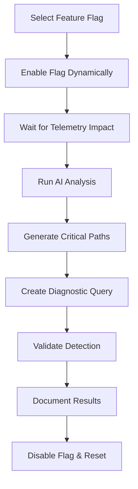

# Feature: Diagnostics UI Fine-Tuning

## Status: Design Complete ✅ | Implementation Pending 🔄

**Feature ID**: FEAT-005  
**Status**: Design Phase  
**Created**: 2025-01-09  
**Author**: Claude Code with Human Architect  
**Priority**: High  
**Target Release**: Phase 3-4 Test Infrastructure  
**Last Updated**: 2025-01-09

## Overview

### Purpose

Create a manual diagnostics UI that allows dynamic control of OpenTelemetry Demo feature flags to systematically test and tune the AI analysis pipeline. This feature enables controlled injection of known issues into the telemetry stream, allowing validation and refinement of:

1. **AI Analysis Detection** - Verifying anomaly detection algorithms identify injected issues
2. **Critical Path Generation** - Testing path analysis against known bottlenecks and failures
3. **Diagnostic Query Generation** - Validating LLM-generated queries against specific problem scenarios

### Target Workflow



## Feature Flag Integration

### Available OTel Demo Feature Flags

Based on the OpenTelemetry Demo documentation, the following feature flags will be integrated:

#### Service Failure Flags
- **`adServiceFailure`** - Generates errors in `GetAds` 10% of the time
- **`cartServiceFailure`** - Errors when `EmptyCart` is called
- **`productCatalogFailure`** - Errors for specific product requests
- **`paymentServiceFailure`** - Errors when calling the `charge` method
- **`paymentServiceUnreachable`** - Simulates payment service being unavailable

#### Performance Issues

- **`adServiceHighCpu`** - Induces high CPU load in ad service
- **`adServiceManualGc`** - Triggers full manual garbage collections
- **`imageSlowLoad`** - Delays product image loading using Envoy fault injection
- **`loadgeneratorFloodHomepage`** - Generates massive homepage request traffic

#### System-Level Issues

- **`recommendationServiceCacheFailure`** - Creates memory leak with exponentially growing cache
- **`kafkaQueueProblems`** - Overloads Kafka queue and introduces consumer-side delays

### Feature Flag Control Architecture

```typescript
// Feature flag service interface
export interface FeatureFlagController extends Context.Tag<'FeatureFlagController', {
  readonly listFlags: () => Effect.Effect<readonly FeatureFlag[], FlagControlError, never>
  readonly getFlag: (flagName: string) => Effect.Effect<FeatureFlag, FlagNotFoundError, never>
  readonly enableFlag: (flagName: string, enabled: boolean) => Effect.Effect<void, FlagControlError, never>
  readonly getFlagStatus: () => Effect.Effect<FlagStatus[], FlagControlError, never>
}> {}

// Feature flag definitions
export const FeatureFlag = Schema.Struct({
  name: Schema.String,
  enabled: Schema.Boolean,
  description: Schema.String,
  category: Schema.Literal('service_failure', 'performance', 'system_level'),
  severity: Schema.Literal('low', 'medium', 'high'),
  expectedImpact: Schema.Struct({
    services: Schema.Array(Schema.String),
    metrics: Schema.Array(Schema.String),
    errorTypes: Schema.Array(Schema.String)
  })
})
```

## UI Design

### Primary Components

#### 1. Feature Flag Dashboard

```typescript
interface FeatureFlagDashboardProps {
  flags: FeatureFlag[]
  onFlagToggle: (flagName: string, enabled: boolean) => void
  currentAnalysis?: AnalysisSession
}

// Categories for organized display
const FLAG_CATEGORIES = {
  service_failure: {
    title: 'Service Failures',
    description: 'Inject service-level errors and failures',
    color: '#ef4444'
  },
  performance: {
    title: 'Performance Issues', 
    description: 'Create performance bottlenecks and resource constraints',
    color: '#f59e0b'
  },
  system_level: {
    title: 'System-Level Problems',
    description: 'Infrastructure and queue-level issues',
    color: '#8b5cf6'
  }
}
```

#### 2. Analysis Session Manager

```typescript
interface AnalysisSession {
  id: string
  flagName: string
  startTime: Date
  status: 'preparing' | 'active' | 'analyzing' | 'completed' | 'failed'
  phases: {
    flagEnabled: boolean
    telemetryImpactDetected: boolean
    aiAnalysisCompleted: boolean
    criticalPathsGenerated: boolean
    diagnosticQueryCreated: boolean
  }
  results?: {
    detectedAnomalies: Anomaly[]
    criticalPaths: CriticalPath[]
    diagnosticQuery: string
    validationStatus: 'passed' | 'failed' | 'partial'
  }
}
```

#### 3. Real-Time Impact Visualization

```typescript
interface ImpactVisualizationProps {
  session: AnalysisSession
  telemetryMetrics: TelemetryMetrics
  refreshInterval: number
}

// Metrics to track during flag activation
interface TelemetryMetrics {
  errorRates: Record<string, number>
  latencyPercentiles: Record<string, LatencyData>
  throughputChanges: Record<string, number>
  serviceHealth: Record<string, 'healthy' | 'degraded' | 'failing'>
}
```

### UI Layout Structure

```text
┌─ Diagnostics UI Fine-Tuning ────────────────────────────────────────┐
│                                                                     │
│ ┌─ Feature Flag Controls ─────────┐  ┌─ Active Session ──────────┐ │
│ │                                 │  │                           │ │
│ │ 🔴 Service Failures             │  │ Session: payment-failure  │ │
│ │ ☐ adServiceFailure              │  │ Status: ⏱️  Analyzing     │ │
│ │ ☐ cartServiceFailure            │  │                           │ │
│ │ ☐ paymentServiceFailure ✓       │  │ Phases:                   │ │
│ │                                 │  │ ✅ Flag Enabled           │ │
│ │ 🟡 Performance Issues           │  │ ✅ Impact Detected        │ │
│ │ ☐ adServiceHighCpu              │  │ ⏱️  AI Analysis           │ │
│ │ ☐ imageSlowLoad                 │  │ ⏳ Critical Paths         │ │
│ │                                 │  │ ⏳ Diagnostic Query       │ │
│ │ 🟣 System-Level                 │  │                           │ │
│ │ ☐ kafkaQueueProblems            │  │ [Stop Session] [Reset]    │ │
│ │ ☐ recommendationCacheFailure    │  └───────────────────────────┘ │
│ └─────────────────────────────────┘                                │
│                                                                     │
│ ┌─ Real-Time Impact Metrics ──────────────────────────────────────┐ │
│ │                                                                 │ │
│ │ Error Rate Trend    [📈]    Latency P95      [📊]             │ │
│ │ Service Health      [🔴🟡🟢] Critical Paths   [🔗]             │ │
│ │                                                                 │ │
│ └─────────────────────────────────────────────────────────────────┘ │
│                                                                     │
│ ┌─ Analysis Results ──────────────────────────────────────────────┐ │
│ │                                                                 │ │
│ │ Generated Diagnostic Query:                                     │ │
│ │ ```sql                                                          │ │
│ │ SELECT service_name, operation_name, error_rate                 │ │
│ │ FROM traces WHERE service_name = 'paymentservice'               │ │
│ │ AND status_code = 'ERROR' ...                                   │ │
│ │ ```                                                             │ │
│ │                                                                 │ │
│ │ Critical Paths Identified: 3                                    │ │
│ │ Anomalies Detected: ✅ Payment failures, ❌ Cart timeouts        │ │
│ │                                                                 │ │
│ │ [Execute Query] [Validate Analysis] [Export Results]            │ │
│ └─────────────────────────────────────────────────────────────────┘ │
└─────────────────────────────────────────────────────────────────────┘
```

## Technical Implementation

### Feature Flag Communication

#### Integration with flagd Service

```typescript
// HTTP client for flagd flag management
export const FlagdClient = Layer.succeed(
  FeatureFlagController,
  {
    listFlags: () => 
      Effect.tryPromise({
        try: () => fetch('http://localhost:8080/flagd/management/flags'),
        catch: (error) => new FlagControlError({ message: String(error) })
      }).pipe(
        Effect.flatMap(response => Effect.tryPromise({
          try: () => response.json(),
          catch: () => new FlagControlError({ message: 'Failed to parse flags' })
        }))
      ),

    enableFlag: (flagName: string, enabled: boolean) =>
      Effect.tryPromise({
        try: () => fetch(`http://localhost:8080/flagd/management/flags/${flagName}`, {
          method: 'PATCH',
          headers: { 'Content-Type': 'application/json' },
          body: JSON.stringify({ enabled })
        }),
        catch: (error) => new FlagControlError({ message: String(error) })
      }).pipe(Effect.asVoid)
  }
)
```

#### Feature Flag Definitions

```typescript
export const DEMO_FEATURE_FLAGS: FeatureFlag[] = [
  {
    name: 'paymentServiceFailure',
    enabled: false,
    description: 'Errors when calling the charge method',
    category: 'service_failure',
    severity: 'high',
    expectedImpact: {
      services: ['paymentservice'],
      metrics: ['error_rate', 'success_rate'],
      errorTypes: ['payment_processing_error', 'service_unavailable']
    }
  },
  {
    name: 'adServiceHighCpu',
    enabled: false, 
    description: 'Induces high CPU load in ad service',
    category: 'performance',
    severity: 'medium',
    expectedImpact: {
      services: ['adservice'],
      metrics: ['cpu_utilization', 'response_latency'],
      errorTypes: ['timeout_error', 'resource_exhaustion']
    }
  }
  // ... additional flags
]
```

### Analysis Pipeline Integration

#### Session Management

```typescript
export const DiagnosticsSession = Schema.Struct({
  id: Schema.String,
  flagName: Schema.String,
  startTime: Schema.Date,
  endTime: Schema.optional(Schema.Date),
  status: Schema.Literal('preparing', 'active', 'analyzing', 'completed', 'failed'),
  configuration: Schema.Struct({
    waitTimeSeconds: Schema.Number,  // Wait time after flag activation
    analysisWindowMinutes: Schema.Number,  // Analysis window duration
    expectedImpact: FeatureFlag.pipe(Schema.pick('expectedImpact'))
  }),
  results: Schema.optional(Schema.Struct({
    aiAnalysis: AiAnalysisResult,
    criticalPaths: Schema.Array(CriticalPath),
    diagnosticQuery: Schema.String,
    validationResults: ValidationResults
  }))
})
```

#### Workflow Orchestration

```typescript
export const runDiagnosticsSession = (
  flagName: string,
  configuration: SessionConfiguration
): Effect.Effect<DiagnosticsSession, DiagnosticsError, 
  FeatureFlagController | AiAnalyzer | UiGenerator | Storage> =>
  Effect.gen(function* () {
    const sessionId = crypto.randomUUID()
    const flagController = yield* FeatureFlagController
    const aiAnalyzer = yield* AiAnalyzer
    const uiGenerator = yield* UiGenerator
    
    // Phase 1: Enable feature flag
    yield* Effect.log(`Starting diagnostics session ${sessionId} with flag ${flagName}`)
    yield* flagController.enableFlag(flagName, true)
    
    // Phase 2: Wait for telemetry impact
    yield* Effect.log('Waiting for telemetry impact...')
    yield* Effect.sleep(Duration.seconds(configuration.waitTimeSeconds))
    
    // Phase 3: Run AI analysis
    yield* Effect.log('Running AI analysis...')
    const aiResults = yield* aiAnalyzer.analyzeAnomalies({
      timeRange: {
        startTime: new Date(Date.now() - configuration.analysisWindowMinutes * 60 * 1000).toISOString(),
        endTime: new Date().toISOString()
      },
      focusServices: configuration.expectedImpact.services
    })
    
    // Phase 4: Generate critical paths
    yield* Effect.log('Generating critical paths...')
    const criticalPaths = yield* uiGenerator.generateQuery({
      analysisType: 'critical_path_analysis',
      timeRange: {
        startTime: new Date(Date.now() - configuration.analysisWindowMinutes * 60 * 1000).toISOString(),
        endTime: new Date().toISOString()
      },
      context: `Analyzing impact of ${flagName} feature flag activation`
    })
    
    // Phase 5: Generate diagnostic query
    yield* Effect.log('Creating diagnostic query...')
    const diagnosticQuery = yield* uiGenerator.generateQuery({
      analysisType: 'error_analysis',
      timeRange: {
        startTime: new Date(Date.now() - configuration.analysisWindowMinutes * 60 * 1000).toISOString(),
        endTime: new Date().toISOString()
      },
      services: configuration.expectedImpact.services,
      context: `Diagnostic query for ${flagName} failure pattern`
    })
    
    // Phase 6: Validate results
    const validation = yield* validateDiagnosticResults({
      expectedErrors: configuration.expectedImpact.errorTypes,
      detectedAnomalies: aiResults.anomalies,
      generatedQuery: diagnosticQuery.query
    })
    
    // Phase 7: Cleanup - disable flag
    yield* flagController.enableFlag(flagName, false)
    yield* Effect.log(`Diagnostics session ${sessionId} completed`)
    
    return {
      id: sessionId,
      flagName,
      startTime: new Date(),
      endTime: new Date(),
      status: validation.overall === 'passed' ? 'completed' : 'failed',
      configuration,
      results: {
        aiAnalysis: aiResults,
        criticalPaths: criticalPaths,
        diagnosticQuery: diagnosticQuery.query,
        validationResults: validation
      }
    }
  })
```

### Real-Time Monitoring

#### Telemetry Impact Detection

```typescript
export const TelemetryImpactMonitor = Layer.effect(
  TelemetryImpactMonitor,
  Effect.gen(function* () {
    const storage = yield* Storage
    
    return {
      monitorImpact: (flagName: string, expectedServices: string[]) =>
        Stream.repeatEffectWithSchedule(
          storage.getServiceMetrics(expectedServices),
          Schedule.spaced(Duration.seconds(5))
        ).pipe(
          Stream.map(metrics => ({
            timestamp: new Date(),
            services: expectedServices.map(service => ({
              name: service,
              errorRate: metrics.errorRates[service] || 0,
              latencyP95: metrics.latencyPercentiles[service]?.p95 || 0,
              throughput: metrics.throughputChanges[service] || 0,
              health: determineServiceHealth(metrics, service)
            }))
          }))
        )
    }
  })
)
```

## Testing Strategy

### Manual Testing Workflow

Each feature flag should be tested individually with this process:

1. **Pre-Test Baseline**
   - Record current system metrics
   - Verify all services are healthy
   - Clear any existing alerts or anomalies

2. **Flag Activation**
   - Enable single feature flag via UI
   - Monitor real-time impact visualization
   - Wait for configurable impact detection period (30-120 seconds)

3. **AI Analysis Validation**
   - Trigger AI anomaly detection
   - Verify expected anomalies are detected
   - Document false positives/negatives

4. **Root Cause Investigation**
   - Allow LLM to investigate autonomously
   - Track number of investigation queries
   - Note data sources accessed (traces/logs/metrics)
   - Count human guidance prompts needed
   - Validate hypothesis generation and elimination

5. **Critical Path Analysis**
   - Generate critical paths for affected services
   - Validate paths include expected service dependencies
   - Verify path metrics align with injected issues
   - Check for cascade effect identification

6. **Diagnostic Query Validation**
   - Generate diagnostic query for detected issues
   - Execute query and validate results match expected data
   - Verify query efficiency and accuracy
   - Confirm root cause vs. symptom distinction

7. **Cleanup and Documentation**
   - Disable feature flag
   - Verify system returns to baseline
   - Document results in session history
   - Calculate validation metrics

### Test Scenarios by Flag Category

#### Service Failure Scenarios

```typescript
const SERVICE_FAILURE_TESTS = [
  {
    flag: 'paymentServiceFailure',
    expectedAnomalies: ['payment_error_spike', 'transaction_failure_rate'],
    expectedPaths: ['frontend -> payment-service'],
    expectedQuery: 'error rate analysis on paymentservice',
    rootCauseValidation: {
      expectedRootCause: 'Payment service charge method failure',
      humanGuidanceTarget: 2,
      correlationSources: ['traces', 'logs', 'error_metrics']
    }
  },
  {
    flag: 'cartServiceFailure',
    expectedAnomalies: ['cart_operation_failures', 'empty_cart_errors'],
    expectedPaths: ['frontend -> cart-service'],
    expectedQuery: 'cart service error pattern analysis',
    rootCauseValidation: {
      expectedRootCause: 'EmptyCart operation failure in cart service',
      humanGuidanceTarget: 2,
      correlationSources: ['traces', 'logs']
    }
  }
]
```

#### Performance Issue Scenarios

```typescript
const PERFORMANCE_TESTS = [
  {
    flag: 'adServiceHighCpu',
    expectedAnomalies: ['cpu_utilization_spike', 'response_time_increase'],
    expectedPaths: ['ad-service latency bottleneck'],
    expectedQuery: 'CPU impact on response times',
    rootCauseValidation: {
      expectedRootCause: 'Ad service CPU exhaustion causing timeouts',
      humanGuidanceTarget: 3,
      correlationSources: ['traces', 'metrics', 'cpu_utilization']
    }
  },
  {
    flag: 'imageSlowLoad',
    expectedAnomalies: ['image_load_latency', 'frontend_performance_degradation'],
    expectedPaths: ['frontend -> envoy -> image-service'],
    expectedQuery: 'image loading performance analysis',
    rootCauseValidation: {
      expectedRootCause: 'Envoy fault injection causing image delays',
      humanGuidanceTarget: 3,
      correlationSources: ['traces', 'envoy_logs', 'latency_metrics']
    }
  }
]
```

#### Multi-Factor and Complex Scenarios

```typescript
const COMPLEX_SCENARIOS = [
  {
    name: 'Cascade Failure',
    flags: ['paymentServiceUnreachable', 'cartServiceFailure'],
    description: 'Payment service down causes cart service to fail on checkout',
    expectedRootCause: 'Payment service unavailability cascading to cart operations',
    humanGuidanceTarget: 4,
    investigationPath: ['identify cart errors', 'trace to payment calls', 'discover unreachable service'],
    correlationSources: ['traces', 'service_dependencies', 'error_logs']
  },
  {
    name: 'Hidden Root Cause',
    flags: ['kafkaQueueProblems'],
    description: 'Queue backup appears as general service slowness',
    expectedRootCause: 'Kafka consumer lag causing async processing delays',
    humanGuidanceTarget: 5,
    investigationPath: ['observe service latency', 'check async operations', 'identify queue metrics'],
    correlationSources: ['traces', 'kafka_metrics', 'consumer_lag']
  },
  {
    name: 'Red Herring Scenario',
    flags: ['adServiceManualGc', 'imageSlowLoad'],
    description: 'GC pauses look like root cause but image delays are the real issue',
    expectedRootCause: 'Image loading delays, not GC pauses',
    humanGuidanceTarget: 3,
    investigationPath: ['notice GC metrics', 'validate impact', 'discover actual image delays'],
    correlationSources: ['traces', 'gc_metrics', 'network_latency']
  }
]
```

## Configuration

### Environment Variables

```bash
# Feature Flag Integration
FLAGD_ENDPOINT=http://localhost:8080
FEATURE_FLAG_WAIT_TIME=60
ANALYSIS_WINDOW_MINUTES=5

# Session Management  
MAX_CONCURRENT_SESSIONS=1
SESSION_TIMEOUT_MINUTES=30
AUTO_CLEANUP_ENABLED=true

# Real-Time Monitoring
TELEMETRY_REFRESH_INTERVAL=5000
IMPACT_DETECTION_THRESHOLD=0.1
```

### UI Configuration

```typescript
export const DIAGNOSTICS_UI_CONFIG = {
  refreshIntervals: {
    flagStatus: 2000,      // 2 seconds
    telemetryMetrics: 5000, // 5 seconds  
    sessionStatus: 3000     // 3 seconds
  },
  analysisDefaults: {
    waitTimeSeconds: 60,
    analysisWindowMinutes: 5,
    autoCleanup: true
  },
  visualization: {
    errorRateThreshold: 0.05,  // 5% error rate alert
    latencyThreshold: 1000,    // 1s latency alert
    maxDataPoints: 100         // Chart data limit
  }
}
```

## Model Fine-Tuning Integration

### Overview

This feature integrates comprehensive model fine-tuning capabilities to continuously improve diagnostic accuracy based on validated session results. The system learns from human corrections and expert feedback to create custom-trained models optimized for your specific observability patterns.

### Training Data Collection Architecture

#### Automatic Session Capture

```typescript
export const TrainingDataCollector = Schema.Struct({
  sessionId: Schema.String,
  timestamp: Schema.Date,
  diagnosticData: Schema.Struct({
    flagActivated: Schema.String,
    expectedImpact: FeatureFlag.pipe(Schema.pick('expectedImpact')),
    detectedAnomalies: Schema.Array(AnomalyResultSchema),
    generatedQuery: Schema.String,
    criticalPaths: Schema.Array(CriticalPath),
    rootCauseIdentified: Schema.String
  }),
  groundTruth: Schema.Struct({
    actualRootCause: Schema.String,
    wasCorrect: Schema.Boolean,
    humanCorrections: Schema.optional(Schema.Array(Schema.String)),
    expertNotes: Schema.optional(Schema.String)
  }),
  modelPerformance: Schema.Struct({
    humanPromptsRequired: Schema.Number,
    timeToRootCause: Schema.Number,
    confidenceScore: Schema.Number,
    dataSources: Schema.Array(Schema.Literal('traces', 'logs', 'metrics'))
  })
})
```

#### Training Data Pipeline

```typescript
export const TrainingDataPipeline = Layer.effect(
  TrainingDataService,
  Effect.gen(function* () {
    const storage = yield* Storage

    return {
      collectSessionData: (session: DiagnosticsSession) =>
        Effect.gen(function* () {
          // Extract training examples from session
          const trainingExamples = yield* extractTrainingExamples(session)

          // Format for different training backends
          const jsonlData = yield* formatAsJSONL(trainingExamples)
          const huggingfaceData = yield* formatAsHuggingFace(trainingExamples)

          // Store in database
          yield* storage.storeTrainingData({
            sessionId: session.id,
            examples: trainingExamples,
            formats: {
              jsonl: jsonlData,
              huggingface: huggingfaceData
            }
          })

          return { examplesCollected: trainingExamples.length }
        }),

      exportDataset: (format: ExportFormat, filters?: DatasetFilters) =>
        Effect.gen(function* () {
          const data = yield* storage.getTrainingData(filters)

          switch (format) {
            case 'jsonl':
              return yield* exportAsJSONL(data)
            case 'huggingface':
              return yield* exportAsHuggingFace(data)
            case 'llama-factory':
              return yield* exportAsLlamaFactory(data)
            case 'label-studio':
              return yield* exportAsLabelStudio(data)
          }
        })
    }
  })
)
```

### Label Studio Integration

#### Deployment Configuration

```yaml
# docker-compose.yml addition
label-studio:
  image: heartexlabs/label-studio:latest
  container_name: otel-ai-label-studio
  ports:
    - "8200:8080"
  volumes:
    - ./data/label-studio:/label-studio/data
    - ./configs/label-studio:/label-studio/config
  environment:
    - LABEL_STUDIO_LOCAL_FILES_SERVING_ENABLED=true
    - LABEL_STUDIO_LOCAL_FILES_DOCUMENT_ROOT=/label-studio/data
    - DJANGO_DB=default
    - POSTGRE_NAME=label_studio
    - POSTGRE_USER=postgres
    - POSTGRE_PASSWORD=postgres
    - POSTGRE_HOST=postgres
    - POSTGRE_PORT=5432
  networks:
    - otel-network
```

#### Annotation Templates

```typescript
export const ANNOTATION_TEMPLATES = {
  rootCauseValidation: {
    name: 'Root Cause Validation',
    config: `
      <View>
        <Text name="diagnostic_prompt" value="$prompt"/>
        <Text name="ai_response" value="$response"/>
        <Text name="expected_root_cause" value="$expected_root_cause"/>

        <Choices name="validation" toName="ai_response" choice="single">
          <Choice value="correct"/>
          <Choice value="partially_correct"/>
          <Choice value="incorrect"/>
        </Choices>

        <TextArea name="corrections" toName="ai_response"
                  placeholder="Provide corrections if needed"
                  rows="4" maxSubmissions="1"/>

        <Rating name="confidence" toName="ai_response" maxRating="5"/>
      </View>
    `
  },

  queryQualityRating: {
    name: 'Diagnostic Query Quality',
    config: `
      <View>
        <Text name="generated_query" value="$query"/>
        <Text name="context" value="$context"/>

        <Rating name="relevance" toName="generated_query" maxRating="5"/>
        <Rating name="accuracy" toName="generated_query" maxRating="5"/>
        <Rating name="efficiency" toName="generated_query" maxRating="5"/>

        <TextArea name="improved_query" toName="generated_query"
                  placeholder="Provide improved query if needed"/>
      </View>
    `
  }
}
```

#### Label Studio API Client

```typescript
export const LabelStudioClient = Layer.effect(
  LabelStudioService,
  Effect.gen(function* () {
    const config = yield* Config.config
    const baseUrl = config.labelStudioUrl || 'http://localhost:8200'
    const apiKey = config.labelStudioApiKey

    return {
      createProject: (name: string, template: string) =>
        Effect.tryPromise({
          try: () => fetch(`${baseUrl}/api/projects`, {
            method: 'POST',
            headers: {
              'Authorization': `Token ${apiKey}`,
              'Content-Type': 'application/json'
            },
            body: JSON.stringify({
              title: name,
              label_config: template,
              enable_empty_annotation: false
            })
          }).then(res => res.json()),
          catch: (error) => new LabelStudioError({ message: String(error) })
        }),

      importTasks: (projectId: number, tasks: any[]) =>
        Effect.tryPromise({
          try: () => fetch(`${baseUrl}/api/projects/${projectId}/import`, {
            method: 'POST',
            headers: {
              'Authorization': `Token ${apiKey}`,
              'Content-Type': 'application/json'
            },
            body: JSON.stringify(tasks)
          }),
          catch: (error) => new LabelStudioError({ message: String(error) })
        }),

      exportAnnotations: (projectId: number) =>
        Effect.tryPromise({
          try: () => fetch(`${baseUrl}/api/projects/${projectId}/export?format=JSON`, {
            headers: { 'Authorization': `Token ${apiKey}` }
          }).then(res => res.json()),
          catch: (error) => new LabelStudioError({ message: String(error) })
        })
    }
  })
)
```

### LLaMA-Factory Integration

#### Deployment Configuration

```yaml
# docker-compose.yml addition
llama-factory:
  image: hiyouga/llama-factory:latest
  container_name: otel-ai-llama-factory
  ports:
    - "7860:7860"  # Gradio Web UI
    - "8000:8000"  # API Server
  volumes:
    - ./data/llama-factory/models:/app/models
    - ./data/llama-factory/datasets:/app/data
    - ./data/llama-factory/checkpoints:/app/saves
    - ./configs/llama-factory:/app/configs
  environment:
    - CUDA_VISIBLE_DEVICES=0
    - GRADIO_SERVER_NAME=0.0.0.0
    - GRADIO_SERVER_PORT=7860
  deploy:
    resources:
      reservations:
        devices:
          - driver: nvidia
            count: 1
            capabilities: [gpu]
  networks:
    - otel-network
```

#### Fine-Tuning Configuration

```typescript
export const LlamaFactoryConfig = Schema.Struct({
  baseModel: Schema.Literal('llama3', 'llama2', 'mistral', 'qwen'),
  trainingMethod: Schema.Literal('lora', 'qlora', 'full', 'freeze'),
  loraConfig: Schema.optional(Schema.Struct({
    rank: Schema.Number,            // LoRA rank (default: 8)
    alpha: Schema.Number,           // LoRA alpha (default: 16)
    dropout: Schema.Number,         // LoRA dropout (default: 0.1)
    targetModules: Schema.Array(Schema.String) // ['q_proj', 'v_proj']
  })),
  quantizationConfig: Schema.optional(Schema.Struct({
    bits: Schema.Literal(2, 3, 4, 5, 6, 8),
    method: Schema.Literal('gptq', 'awq', 'aqlm', 'eetq', 'hqq')
  })),
  trainingArgs: Schema.Struct({
    epochs: Schema.Number,
    batchSize: Schema.Number,
    learningRate: Schema.Number,
    warmupSteps: Schema.Number,
    gradientAccumulation: Schema.Number,
    maxLength: Schema.Number
  }),
  optimizations: Schema.Struct({
    flashAttention: Schema.Boolean,
    unsloth: Schema.Boolean,
    deepspeed: Schema.Boolean,
    gradientCheckpointing: Schema.Boolean
  })
})
```

#### LLaMA-Factory Service

```typescript
export const LlamaFactoryService = Layer.effect(
  FineTuningBackend,
  Effect.gen(function* () {
    const config = yield* Config.config
    const apiUrl = config.llamaFactoryUrl || 'http://localhost:8000'

    return {
      prepareDataset: (data: TrainingData[]) =>
        Effect.gen(function* () {
          // Convert to LLaMA-Factory format
          const dataset = data.map(item => ({
            instruction: item.prompt,
            input: item.context,
            output: item.expectedResponse,
            history: item.conversationHistory || []
          }))

          // Save to datasets directory
          const datasetPath = `/app/data/otel-diagnostics-${Date.now()}.json`
          yield* saveDataset(dataset, datasetPath)

          return { datasetPath, examples: dataset.length }
        }),

      startFineTuning: (config: LlamaFactoryConfig, datasetPath: string) =>
        Effect.tryPromise({
          try: () => fetch(`${apiUrl}/api/train`, {
            method: 'POST',
            headers: { 'Content-Type': 'application/json' },
            body: JSON.stringify({
              model_name_or_path: config.baseModel,
              dataset: datasetPath,
              adapter_name: `otel-diagnostics-${Date.now()}`,
              finetuning_type: config.trainingMethod,
              lora_target: config.loraConfig?.targetModules?.join(','),
              lora_rank: config.loraConfig?.rank,
              lora_alpha: config.loraConfig?.alpha,
              lora_dropout: config.loraConfig?.dropout,
              quantization_bit: config.quantizationConfig?.bits,
              num_train_epochs: config.trainingArgs.epochs,
              per_device_train_batch_size: config.trainingArgs.batchSize,
              learning_rate: config.trainingArgs.learningRate,
              warmup_steps: config.trainingArgs.warmupSteps,
              gradient_accumulation_steps: config.trainingArgs.gradientAccumulation,
              cutoff_len: config.trainingArgs.maxLength,
              flash_attn: config.optimizations.flashAttention,
              use_unsloth: config.optimizations.unsloth
            })
          }).then(res => res.json()),
          catch: (error) => new FineTuningError({ message: String(error) })
        }),

      monitorTraining: (jobId: string) =>
        Stream.repeatEffectWithSchedule(
          Effect.tryPromise({
            try: () => fetch(`${apiUrl}/api/train/${jobId}/status`)
              .then(res => res.json()),
            catch: (error) => new FineTuningError({ message: String(error) })
          }),
          Schedule.spaced(Duration.seconds(10))
        ),

      evaluateModel: (modelPath: string, testSet: TestData[]) =>
        Effect.tryPromise({
          try: () => fetch(`${apiUrl}/api/evaluate`, {
            method: 'POST',
            headers: { 'Content-Type': 'application/json' },
            body: JSON.stringify({
              model_path: modelPath,
              test_data: testSet,
              metrics: ['accuracy', 'perplexity', 'bleu', 'rouge']
            })
          }).then(res => res.json()),
          catch: (error) => new EvaluationError({ message: String(error) })
        })
    }
  })
)
```

### Model Evaluation & Deployment

#### A/B Testing Framework

```typescript
export const ModelABTester = Layer.effect(
  ABTestingService,
  Effect.gen(function* () {
    const storage = yield* Storage
    const metrics = yield* MetricsCollector

    return {
      createExperiment: (baseModel: string, fineTunedModel: string, config: ABConfig) =>
        Effect.gen(function* () {
          const experimentId = crypto.randomUUID()

          yield* storage.createExperiment({
            id: experimentId,
            baseModel,
            fineTunedModel,
            trafficSplit: config.trafficSplit || 0.5,
            startTime: new Date(),
            status: 'active'
          })

          return experimentId
        }),

      routeRequest: (experimentId: string) =>
        Effect.gen(function* () {
          const experiment = yield* storage.getExperiment(experimentId)
          const random = Math.random()

          return random < experiment.trafficSplit
            ? { model: experiment.fineTunedModel, variant: 'treatment' }
            : { model: experiment.baseModel, variant: 'control' }
        }),

      collectMetrics: (experimentId: string, variant: 'control' | 'treatment', result: DiagnosticResult) =>
        Effect.gen(function* () {
          yield* metrics.record({
            experimentId,
            variant,
            metrics: {
              accuracy: result.wasCorrect ? 1 : 0,
              humanPromptsRequired: result.humanPromptsRequired,
              timeToRootCause: result.timeToRootCause,
              confidenceScore: result.confidenceScore
            }
          })
        }),

      analyzeResults: (experimentId: string) =>
        Effect.gen(function* () {
          const data = yield* storage.getExperimentData(experimentId)

          // Statistical significance testing
          const stats = yield* calculateStatistics(data)

          return {
            sampleSize: data.length,
            controlMetrics: stats.control,
            treatmentMetrics: stats.treatment,
            improvement: {
              accuracy: stats.treatment.accuracy - stats.control.accuracy,
              humanPromptsReduction: stats.control.humanPrompts - stats.treatment.humanPrompts,
              speedImprovement: stats.control.timeToRootCause - stats.treatment.timeToRootCause
            },
            pValue: stats.pValue,
            isSignificant: stats.pValue < 0.05,
            recommendation: stats.pValue < 0.05 && stats.treatment.accuracy > stats.control.accuracy
              ? 'deploy_fine_tuned'
              : 'keep_base_model'
          }
        })
    }
  })
)
```

#### Performance Metrics Dashboard

```typescript
interface FineTuningMetricsDashboardProps {
  experiments: ABExperiment[]
  trainingJobs: TrainingJob[]
  modelVersions: ModelVersion[]
}

const FineTuningMetricsDashboard: React.FC<FineTuningMetricsDashboardProps> = ({
  experiments,
  trainingJobs,
  modelVersions
}) => (
  <div className="fine-tuning-dashboard">
    <div className="training-status">
      <h3>Active Training Jobs</h3>
      {trainingJobs.map(job => (
        <TrainingJobCard
          key={job.id}
          job={job}
          progress={job.progress}
          metrics={job.currentMetrics}
        />
      ))}
    </div>

    <div className="ab-experiments">
      <h3>A/B Testing Results</h3>
      {experiments.map(exp => (
        <ExperimentResults
          key={exp.id}
          experiment={exp}
          showStatistics={true}
          showRecommendation={true}
        />
      ))}
    </div>

    <div className="model-comparison">
      <h3>Model Performance Comparison</h3>
      <ModelComparisonChart
        models={modelVersions}
        metrics={['accuracy', 'latency', 'cost', 'human_intervention']}
      />
    </div>

    <div className="annotation-queue">
      <h3>Pending Annotations</h3>
      <AnnotationQueueWidget
        pendingCount={getPendingAnnotations()}
        labelStudioUrl="http://localhost:8200"
      />
    </div>
  </div>
)
```

### Database Schema for Fine-Tuning

```sql
-- Training data storage
CREATE TABLE training_data (
  id String,
  session_id String,
  timestamp DateTime64(9),
  prompt Text,
  context Text,
  response Text,
  expected_response Text,
  ground_truth Text,
  human_feedback Text,
  confidence_score Float32,
  model_version String,
  data_source LowCardinality(String),
  created_at DateTime64(9)
) ENGINE = MergeTree()
PARTITION BY toYYYYMM(created_at)
ORDER BY (created_at, session_id);

-- Model versions tracking
CREATE TABLE model_versions (
  id String,
  base_model String,
  version String,
  training_job_id String,
  training_method LowCardinality(String), -- lora, qlora, full
  training_config JSON,
  metrics JSON,
  evaluation_results JSON,
  deployed Boolean DEFAULT false,
  deployed_at Nullable(DateTime64(9)),
  created_at DateTime64(9)
) ENGINE = MergeTree()
ORDER BY created_at;

-- A/B testing experiments
CREATE TABLE ab_experiments (
  id String,
  name String,
  base_model_id String,
  fine_tuned_model_id String,
  traffic_split Float32,
  status LowCardinality(String),
  start_time DateTime64(9),
  end_time Nullable(DateTime64(9)),
  results JSON,
  created_at DateTime64(9)
) ENGINE = MergeTree()
ORDER BY created_at;

-- Annotation tasks for Label Studio
CREATE TABLE annotation_tasks (
  id String,
  project_id String,
  task_data JSON,
  annotations JSON,
  status LowCardinality(String),
  annotator String,
  completed_at Nullable(DateTime64(9)),
  created_at DateTime64(9)
) ENGINE = MergeTree()
ORDER BY created_at;
```

## Future Enhancements

### Automated Testing Pipeline

- Scheduled runs of all feature flags
- Regression detection for AI analysis accuracy
- Performance benchmarking across scenarios

### Advanced Scenario Composition

- Multiple simultaneous feature flags
- Custom failure scenarios
- Time-based activation patterns

### Advanced Fine-Tuning Features

- Multi-task learning for different diagnostic scenarios
- Federated learning across multiple deployments
- Reinforcement learning from human feedback (RLHF)
- Continuous learning pipeline with automatic retraining

### Export and Reporting

- Session result export to various formats
- Trend analysis across multiple sessions
- Integration with external monitoring systems
- Model performance reports and dashboards

## Success Metrics

### Primary Objectives

1. **Detection Accuracy**: AI analysis correctly identifies 90%+ of injected issues
2. **Query Relevance**: Generated diagnostic queries return actionable insights
3. **Path Accuracy**: Critical paths include actual affected service chains
4. **Response Time**: Full analysis cycle completes within 5 minutes
5. **Root Cause Identification Rate**: Correctly identify root cause in 75%+ of test scenarios
6. **Autonomous Investigation Success**: >60% of scenarios resolved with <3 human prompts

### Quality Metrics

- False positive rate < 10%
- False negative rate < 5%
- Query execution time < 30 seconds
- UI responsiveness during analysis
- **Human Guidance Requirements**: Track prompts needed per diagnostic session
- **Investigation Path Efficiency**: <5 irrelevant queries per successful root cause
- **Cross-Data Source Correlation**: 80%+ of investigations use traces + logs + metrics
- **Hypothesis Accuracy**: Track initial vs. final hypothesis accuracy rates

### Validation Criteria

#### Root Cause Analysis Validation

```typescript
interface RootCauseValidation {
  scenarioId: string
  expectedRootCause: string
  identifiedRootCause: string
  humanPromptsRequired: number
  investigationQueries: Query[]
  dataSoucesUsed: Set<'traces' | 'logs' | 'metrics' | 'dependencies'>
  timeToIdentification: number // seconds
  hypothesesGenerated: string[]
  falseHypothesesEliminated: string[]
  validationResult: 'correct' | 'partial' | 'incorrect'
}

// Success thresholds
const SUCCESS_THRESHOLDS = {
  rootCauseAccuracy: 0.75,        // 75% correct identification
  maxHumanPrompts: 3,              // Maximum 3 prompts needed
  multiSourceUsage: 0.80,          // 80% use multiple data sources
  timeToRootCause: 600,            // 10 minutes maximum
  irrelevantQueryRatio: 0.2        // <20% of queries are irrelevant
}
```

## Implementation Timeline

### Phase 1: Core Infrastructure

- Feature flag controller service
- Basic UI layout and components
- flagd integration
- Session management

### Phase 2: Analysis Integration

- AI analyzer pipeline integration
- Critical path generation
- Diagnostic query creation  
- Real-time monitoring

### Phase 3: Testing & Refinement

- Manual testing of all feature flags
- UI polish and user experience
- Documentation and training materials
- Performance optimization

This feature provides a controlled environment for validating and tuning the AI analysis pipeline against known issues, enabling systematic improvement of the platform's diagnostic capabilities.