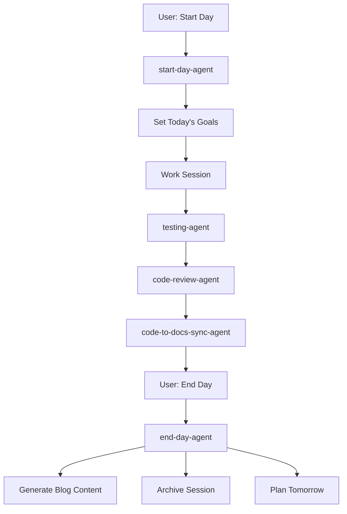
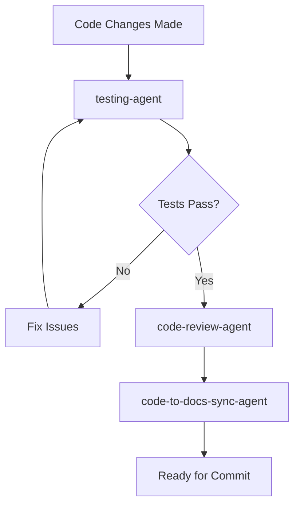

# Subagent Architecture for AI-Native Development Workflow

## Overview

This document defines a specialized subagent architecture for managing the AI-native development workflow. Each subagent has specific responsibilities and can orchestrate other subagents to complete complex multi-step tasks.

## Core Subagent Types

### 1. **start-day-agent**
**Purpose**: Daily planning and goal setting with context awareness
**Capabilities**:
- Review previous day's progress from daily notes
- Gather context about project state and priorities
- Facilitate interactive planning conversation
- Create today's daily note with intelligent goal setting
- Provide project timeline awareness and focus areas
- Set up development environment if needed

**Tools**: Read, Write, Glob, Grep, LS
**Trigger**: `./scripts/start-day.sh` or manual invocation

### 2. **end-day-agent**
**Purpose**: Comprehensive daily review, archiving, and content generation
**Capabilities**:
- Conduct interactive progress review with full context
- Generate high-quality blog content with technical depth
- Archive Claude Code session decisions and discoveries
- Update daily notes with completion status and learnings
- Plan tomorrow's priorities based on actual progress
- Create git tags for daily milestones

**Tools**: Read, Write, Edit, Bash, TodoWrite
**Trigger**: `./scripts/end-day.sh` or manual invocation

### 3. **code-to-docs-sync-agent**
**Purpose**: Bidirectional synchronization between code and documentation
**Capabilities**:
- Analyze code changes and update corresponding package documentation
- Read package specifications and validate implementation alignment
- Generate API documentation from code comments
- Update CLAUDE.md with new patterns and conventions
- Sync architectural decisions between code and design docs

**Tools**: Read, Write, Edit, Glob, Grep, MultiEdit
**Trigger**: Automatic on code changes or manual sync

### 4. **testing-agent**
**Purpose**: Comprehensive test execution and validation
**Capabilities**:
- Execute all test suites (unit, integration, e2e)
- Validate infrastructure dependencies (ClickHouse, containers)
- Run lint and typecheck commands
- Generate test coverage reports
- Identify and report test failures with context
- Suggest test improvements based on code coverage

**Tools**: Bash, Read, Write, Glob
**Trigger**: Before commits, after significant changes

### 5. **code-review-agent**
**Purpose**: Quality assurance and code review automation
**Capabilities**:
- Review code changes for adherence to project conventions
- Check for security issues and best practices
- Validate OpenTelemetry semantic conventions
- Ensure Effect-TS patterns are followed correctly
- Review documentation completeness
- Suggest performance optimizations

**Tools**: Read, Glob, Grep, Write
**Trigger**: After significant implementations, before PRs

### 6. **deployment-agent**
**Purpose**: Build, deployment, and infrastructure management
**Capabilities**:
- Execute build processes and validate outputs
- Manage Docker container lifecycles
- Deploy to staging/production environments
- Monitor deployment health and rollback if needed
- Update deployment documentation

**Tools**: Bash, Read, Write
**Trigger**: On deployment requests, scheduled health checks

## Orchestration Patterns

### Daily Workflow Orchestration



### Code Change Workflow



## Implementation Strategy

### Phase 1: Core Agents (Day 7)
1. Implement `start-day-agent` and `end-day-agent`
2. Update existing shell scripts to use Task tool with subagents
3. Test basic orchestration workflow

### Phase 2: Specialized Agents (Days 8-9)
1. Implement `testing-agent` with comprehensive validation
2. Create `code-review-agent` with project-specific patterns
3. Build `code-to-docs-sync-agent` for bidirectional updates

### Phase 3: Advanced Orchestration (Days 10-12)
1. Implement `deployment-agent` with full CI/CD capabilities
2. Create inter-agent communication protocols
3. Add monitoring and observability for agent performance

## Agent Communication Protocol

Agents communicate through:
- **Shared Context**: Daily notes, project state, git status
- **Task Results**: Structured outputs from previous agents
- **Error Propagation**: Failed tasks trigger rollback or alternative flows
- **State Management**: TodoWrite tool for cross-agent task tracking

## Configuration

Each agent's behavior is configurable through:
- Environment variables (e.g., `OTEL_AI_START_DAY_GOALS=3`)
- Project-specific patterns in CLAUDE.md
- User preferences stored in `.claude-config/`
- Dynamic context from current project state

## Benefits

1. **Specialized Expertise**: Each agent focuses on specific domain knowledge
2. **Consistent Workflows**: Standardized processes reduce cognitive load
3. **Quality Assurance**: Automatic validation at multiple stages
4. **Documentation Sync**: Always-current docs through bidirectional sync
5. **Error Resilience**: Agents can recover from failures and retry
6. **Observability**: Clear insight into development process effectiveness

## Usage Examples

### Starting a Development Day
```bash
./scripts/start-day.sh
# Triggers start-day-agent which:
# - Reviews yesterday's notes/daily/2025.08.19.md
# - Creates today's notes/daily/2025.08.20.md
# - Sets goals based on project timeline and priorities
```

### Ending a Development Day
```bash
./scripts/end-day.sh
# Triggers end-day-agent which:
# - Reviews today's accomplishments
# - Generates blog/platforms/dev-to-2025-08-20.md
# - Updates documentation with session insights
# - Creates day-7 git tag
```

### Continuous Integration
```bash
# On significant code changes, testing-agent automatically:
pnpm test           # Run all tests
pnpm test:integration  # Validate infrastructure
pnpm typecheck      # Type validation
# Then code-review-agent validates patterns and conventions
# Finally code-to-docs-sync-agent updates documentation
```

This architecture enables true AI-native development where specialized agents handle routine tasks, allowing developers to focus on high-value creative work while maintaining high quality and consistency.