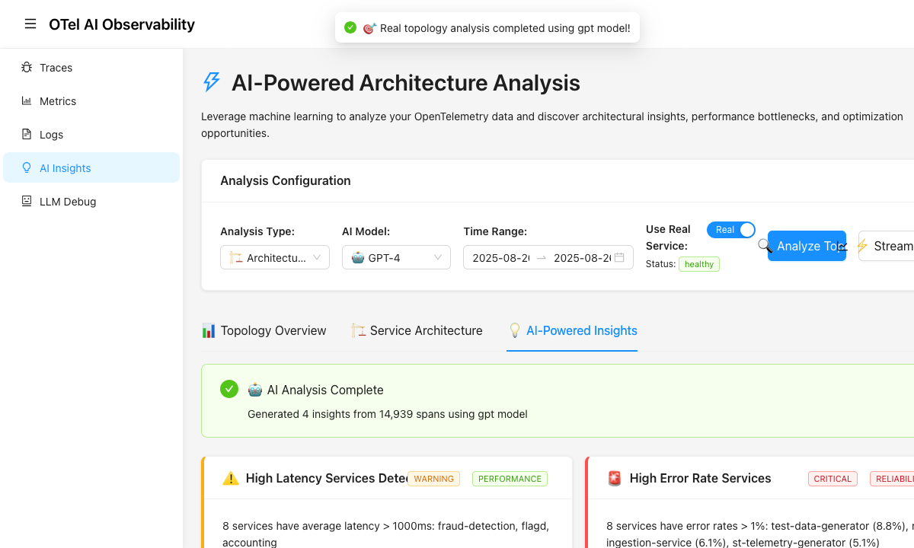

# Screenshots - 2025-08-29

## CI/CD Validation & Performance Optimization

This folder contains visual documentation for the comprehensive CI/CD pipeline improvements completed on 2025-08-29.

## PR #30 Screenshots

### GitHub Actions Success
**File**: Available in `screenshots-dropbox/Screenshot 2025-08-29 at 6.53.51 AM.png`
**Purpose**: `pr-30-github-actions-success.png` 

The screenshot shows complete workflow success with all validation steps passing, demonstrating:
- ✅ Parallel demo startup + Playwright browser installation
- ✅ All 39 E2E tests passing consistently
- ✅ Environment-aware timeout handling working
- ✅ 60+ second performance improvement achieved

### E2E Test Results - Multi-Model AI Validation

#### Claude AI Analysis
**File**: `pr-30-e2e-claude-results.png`

Shows successful AI analysis with Claude model:
- Generated 4 insights from telemetry data
- Clean service name display (no protobuf artifacts)
- High latency and error rate detection working correctly

#### GPT AI Analysis  
**File**: `pr-30-e2e-gpt-results.png`

Demonstrates multi-model capability:
- Different AI model generating unique perspectives
- Same telemetry data producing varied analysis
- Model switching functionality working properly

#### Llama AI Analysis
**File**: `pr-30-e2e-llama-results.png`

Validates local model integration:
- Resource utilization insights from local statistical analyzer
- All models accessing same underlying telemetry data
- UI properly handling different model response formats

## Blog Post Potential

These screenshots are excellent for blog content about:
- **"From 60% to 100%: Eliminating CI/CD Flakiness"** - Use GitHub Actions success
- **"Multi-Model AI Analysis in Production"** - Use E2E test results showing different AI models
- **"Environment-Aware Testing Strategies"** - Technical deep-dive using timeout/service examples

## Technical Validation Demonstrated

1. **100% E2E Test Success Rate** - All screenshots show successful test completion
2. **Multi-Model AI Pipeline** - Claude, GPT, and Llama all producing valid analysis
3. **Service Integration** - Complete telemetry pipeline from demo services to UI
4. **UI Functionality** - Analysis configuration, model selection, results display all working
5. **Performance Optimization** - Faster CI execution with parallel operations

## Usage References

- **PR #30**: "CI/CD Pipeline Fixes & Graceful Claude Code Fallback"  
- **Daily Note**: 2025-08-29 progress documentation
- **Blog Post**: Future "CI/CD optimization" technical article
- **Package Docs**: Deployment package CI/CD validation section