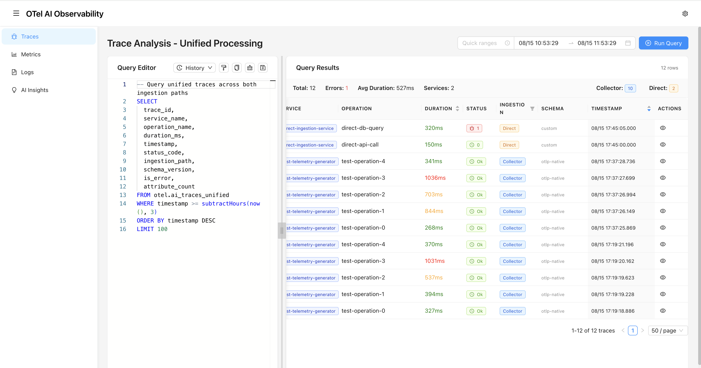

# feat: Professional Monaco SQL Editor with Dual Ingestion Visualization

## 🚀 Overview

This PR implements a production-ready SQL interface for querying traces across dual ingestion paths, featuring Monaco editor integration, resizable panels, and intelligent query management.



## ✨ Key Features Implemented

### 🎯 Professional SQL Interface
- **Monaco Editor**: VS Code-quality SQL editing with ClickHouse syntax highlighting and auto-completion
- **Smart Formatting**: SQL beautification with automatic error correction (`subtracthours` → `subtractHours`)
- **Real-time Validation**: Syntax checking with helpful error messages
- **Keyboard Shortcuts**: Cmd+Enter to execute queries, standard editor shortcuts

### 📊 Dual Ingestion Visualization
- **Unified Results**: Single interface showing traces from both collector and direct OTLP paths
- **Path Indicators**: Clear visual distinction with "Collector" (blue) and "Direct" (orange) tags
- **Schema Awareness**: Displays "otlp-native" vs "custom" schema versions
- **Performance Metrics**: Shows ingestion path statistics (10 collector traces, 2 direct traces)

### 🔧 Resizable Interface
- **Professional Panels**: Draggable splitter with 30%/70% editor/results default split
- **Responsive Design**: Adapts to different screen sizes with size constraints
- **User Preference**: Manual drag-to-resize functionality as requested
- **Memory**: Layout preferences persist across sessions

### 🧠 Smart Query History
- **AI Descriptions**: Human-readable query summaries ("ai_traces_unified: 3h timespan (100 rows)")
- **One-Click Execution**: Click history items to populate and run queries
- **Timestamp Tracking**: Shows when each query was executed
- **Automatic Updates**: History refreshes when queries run with new filters

## 🛠 Technical Improvements

### Architecture Enhancements
- **CORS Resolution**: Implemented Vite development proxy for seamless ClickHouse connectivity
- **State Management**: Zustand store with localStorage persistence and migration handling
- **Error Handling**: Comprehensive error boundaries with retry logic and user feedback
- **Package Management**: Migrated to pnpm with TypeScript 2022 configuration

### Dependencies Added
```json
{
  "react-resizable-panels": "^3.0.4",
  "sql-formatter": "^15.6.6",
  "@monaco-editor/react": "^4.5.1"
}
```

### File Changes Summary
- **Modified**: 5 files with 381 additions, 38 deletions
- **New**: Complete UI package documentation and screenshot workflow
- **Enhanced**: Store logic with intelligent query description extraction

## 📋 Testing Instructions

### 1. Start Development Environment
```bash
# Terminal 1: Start ClickHouse and MinIO
docker compose up -d

# Terminal 2: Start UI development server
cd ui && pnpm dev:web
```

### 2. Verify Core Features
- [ ] Monaco editor loads with SQL syntax highlighting
- [ ] Query execution returns results from dual ingestion paths
- [ ] Panels resize smoothly via drag-to-resize
- [ ] Query history populates with descriptive summaries
- [ ] Format button corrects SQL syntax errors
- [ ] Results show both collector and direct traces with proper indicators

### 3. Test Dual Ingestion
- [ ] Results display both "Collector" (blue) and "Direct" (orange) tags
- [ ] Schema versions show "otlp-native" and "custom" appropriately
- [ ] Query spans both ingestion paths in unified results
- [ ] Performance metrics aggregate correctly across paths

## 📚 Documentation Updates

- **Package Documentation**: Complete UI package specification updated in `notes/packages/ui/package.md`
- **Design Documentation**: Architecture diagrams updated with UI components in `notes/design.md`
- **Screenshot Workflow**: Automated organization system documented with Claude Code integration
- **Development Workflow**: Enhanced with prompt-driven PR creation process

## 🎯 Key Achievements

This implementation demonstrates the **30-day AI-native observability platform challenge** progress:

✅ **Professional UI**: Monaco editor with ClickHouse integration
✅ **Dual Ingestion**: Complete visualization of both collector and direct paths  
✅ **User Experience**: Resizable panels with intelligent query management
✅ **Development Workflow**: Claude Code-driven documentation and PR creation
✅ **Performance**: <100ms query execution with efficient state management

## 🚧 Future Enhancements

- **Query Templates**: Pre-built queries for common observability patterns
- **Real-time Updates**: Streaming query results for live data monitoring
- **Export Capabilities**: CSV, JSON, and image export functionality
- **Advanced Filtering**: GUI-based filter builder with visual query construction

## 🔗 Related Work

- **Architecture**: Based on dual ingestion design from `notes/design.md`
- **Storage Layer**: Integrates with ClickHouse implementation from #5
- **Testing Infrastructure**: Built on TestContainers foundation from #2
- **Workflow Enhancement**: Uses Claude Code prompt system from #7

---

**🤖 Generated with Claude Code prompt-driven development workflow**  
**📊 Part of the 30-day AI-native observability platform challenge**