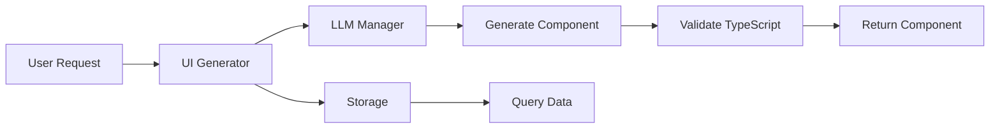

# UI Generator Package

LLM-powered React component generation with Apache ECharts integration for dynamic dashboard creation and telemetry data visualization.

## Implementation Status

✅ **FULLY IMPLEMENTED** - Complete query generation and dynamic UI component generation working in production.

The UI generator consists of two parts:
1. **Query Generation** (`src/ui-generator/`) - Natural language to ClickHouse SQL translation
2. **Component Generation** (`ui/src/`) - Dynamic React components with ECharts visualizations

## Features

- **LLM-powered generation**: Automatically create React components from natural language descriptions
- **Apache ECharts integration**: Generate sophisticated charts and visualizations
- **TypeScript support**: Fully typed component generation with strict type safety
- **OpenTelemetry queries**: Auto-generate optimized ClickHouse queries from user intent
- **Dynamic styling**: Adaptive UI based on data characteristics and user preferences
- **Component templates**: Reusable templates for common observability patterns
- **Real-time updates**: Components with built-in data refresh capabilities
- **Effect-TS Integration**: Full composability with other platform services

## Quick Start

```bash
# Install dependencies
pnpm add @otel-ai/ui-generator

# Set up environment
export OPENAI_API_KEY=your-key-here
export UI_GENERATOR_MODEL=gpt-4
```

### Basic Usage

```typescript
import { UIGeneratorClient, UIGeneratorClientLive } from '@otel-ai/ui-generator'
import { Effect, Layer } from 'effect'

// Generate React component from specification
const program = Effect.gen(function* () {
  const generator = yield* UIGeneratorClient

  // Generate component from natural language
  const component = yield* generator.generateComponent({
    type: 'chart',
    description: 'Show error rates by service for the last hour',
    data: telemetryData
  })

  // Generate complete dashboard
  const dashboard = yield* generator.generateDashboard(
    telemetryData,
    { theme: 'dark', layout: 'grid' }
  )

  return { component, dashboard }
})

const main = program.pipe(Effect.provide(UIGeneratorClientLive))
Effect.runPromise(main).then(console.log)
```

## HTTP Router

The ui-generator package exports an HTTP router for SQL-to-UI generation and query endpoints:

```typescript
import { UIGeneratorRouterLive, UIGeneratorRouterTag } from '@otel-ai/ui-generator/router'
import { Effect } from 'effect'

// Mount the router in your Express app
const program = Effect.gen(function* () {
  const uiGeneratorRouter = yield* UIGeneratorRouterTag
  app.use(uiGeneratorRouter.router)
})

// Provide the router layer
const main = program.pipe(
  Effect.provide(UIGeneratorRouterLive),
  Effect.provide(UIGeneratorAPIClientLayer), // Required dependency
  Effect.provide(LLMManagerAPIClientLayer)   // Required dependency
)
```

**Router Endpoints:**
- `POST /api/ui-generator/from-sql` - Generate UI components from SQL results
- `POST /api/ui-generator/generate-query` - Generate ClickHouse queries from path analysis
- `GET /api/ui-generator/models` - Get available LLM models for generation

## Usage

### Component Generation

```typescript
import { UIGeneratorClient } from '@otel-ai/ui-generator'
import { Effect } from 'effect'

const generateChart = Effect.gen(function* () {
  const generator = yield* UIGeneratorClient

  // Generate ECharts visualization
  const chart = yield* generator.generateChart({
    data: timeSeries,
    type: 'line',
    title: 'Request Latency Over Time',
    xAxis: 'timestamp',
    yAxis: 'latency_ms'
  })

  return chart
})
```

### Dashboard Generation

```typescript
const generateDashboard = Effect.gen(function* () {
  const generator = yield* UIGeneratorClient

  // Generate complete dashboard with multiple charts
  const dashboard = yield* generator.generateDashboard(
    {
      traces: recentTraces,
      metrics: serviceMetrics,
      logs: errorLogs
    },
    {
      theme: 'dark',
      layout: 'responsive',
      refreshInterval: 5000
    }
  )

  return dashboard
})
```

### Role-Based Optimization

```typescript
const optimizeForRole = Effect.gen(function* () {
  const generator = yield* UIGeneratorClient

  // Optimize dashboard for different user roles
  const devDashboard = yield* generator.optimizeForRole(
    baseComponent,
    'developer' // Shows detailed traces and logs
  )

  const execDashboard = yield* generator.optimizeForRole(
    baseComponent,
    'executive' // Shows high-level KPIs
  )

  return { devDashboard, execDashboard }
})
```

## Configuration

```bash
# LLM Configuration
OPENAI_API_KEY=your-key-here
UI_GENERATOR_MODEL=gpt-4

# API Configuration
UI_GENERATOR_API_URL=http://localhost:3000
UI_GENERATOR_AUTH_TOKEN=your-token

# Component Settings
UI_GENERATOR_THEME=dark
UI_GENERATOR_CHART_LIBRARY=echarts
```

## Architecture

### Service Layer Design

```typescript
export interface UIGenerator extends Context.Tag<"UIGenerator", {
  // Component generation
  readonly generateComponent: (
    spec: ComponentSpec
  ) => Effect.Effect<GeneratedComponent, UIError, never>

  // Dashboard generation
  readonly generateDashboard: (
    data: TelemetryData,
    preferences: DashboardPreferences
  ) => Effect.Effect<Dashboard, UIError, never>

  // Validation
  readonly validateComponent: (
    code: string
  ) => Effect.Effect<ValidationResult, UIError, never>

  // Role-based optimization
  readonly optimizeForRole: (
    component: string,
    role: UserRole
  ) => Effect.Effect<string, UIError, never>

  // Chart generation
  readonly generateChart: (
    data: ChartData,
    type: ChartType
  ) => Effect.Effect<EChartsOption, UIError, never>
}>{}
```

### Component Generation Pipeline

1. **Requirements Analysis**: Parse component specifications
2. **LLM Prompting**: Build optimized prompts for code generation
3. **Code Generation**: Generate React/TypeScript components
4. **Validation**: TypeScript compilation and syntax validation
5. **Optimization**: Apply performance optimizations
6. **Integration**: Add ECharts and data bindings

### ECharts Integration

```typescript
// Standard ECharts component template
import React, { useEffect, useRef } from 'react';
import * as echarts from 'echarts';
import { EChartsOption } from 'echarts';

interface ChartProps {
  data: any;
  title?: string;
  height?: number;
}

export const ChartComponent: React.FC<ChartProps> = ({
  data,
  title,
  height = 400
}) => {
  const chartRef = useRef<HTMLDivElement>(null);

  useEffect(() => {
    if (!chartRef.current) return;

    const chart = echarts.init(chartRef.current);
    const option: EChartsOption = {
      title: { text: title },
      tooltip: { trigger: 'axis' },
      // Generated configuration based on data
    };

    chart.setOption(option);

    // Cleanup on unmount
    return () => chart.dispose();
  }, [data, title]);

  return <div ref={chartRef} style={{ height }} />;
};
```

## API Reference

### Core Types

```typescript
interface ComponentSpec {
  type: 'chart' | 'table' | 'metric' | 'alert' | 'custom'
  description: string
  data: unknown
  styling?: {
    theme: 'light' | 'dark'
    colors?: string[]
    responsive: boolean
  }
}

interface GeneratedComponent {
  code: string
  dependencies: string[]
  props: Record<string, unknown>
  preview?: string
}

interface Dashboard {
  layout: Array<{
    id: string
    component: string
    position: {
      x: number
      y: number
      w: number
      h: number
    }
  }>
  theme: string
  refreshInterval: number
}

interface ChartData {
  type: 'line' | 'bar' | 'scatter' | 'pie' | 'heatmap' | 'gauge'
  data: any[]
  xAxis?: string
  yAxis?: string
  series?: string[]
}

type UIError =
  | { _tag: 'InvalidComponent'; errors: ReadonlyArray<string> }
  | { _tag: 'GenerationFailed'; message: string }
  | { _tag: 'ValidationFailed'; code: string; errors: ReadonlyArray<string> }
  | { _tag: 'DependencyError'; missing: ReadonlyArray<string> }
  | { _tag: 'RoleOptimizationError'; role: string; message: string }
```

### Service Methods

#### generateComponent
Generates a React component from a specification.

```typescript
const component = await generator.generateComponent({
  type: 'chart',
  description: 'Show service latency distribution',
  data: latencyData
})
```

#### generateDashboard
Creates a complete dashboard with multiple components.

```typescript
const dashboard = await generator.generateDashboard(
  telemetryData,
  { theme: 'dark', layout: 'grid' }
)
```

#### validateComponent
Validates generated component code.

```typescript
const validation = await generator.validateComponent(componentCode)
if (!validation.valid) {
  console.error('Validation errors:', validation.errors)
}
```

#### generateChart
Generates ECharts configuration from data.

```typescript
const chartConfig = await generator.generateChart({
  type: 'heatmap',
  data: correlationMatrix
})
```

## Configuration

### Environment Variables

```bash
# LLM Configuration
OPENAI_API_KEY=your-openai-key        # OpenAI API key
ANTHROPIC_API_KEY=your-claude-key     # Claude API key (optional)
UI_GENERATOR_MODEL=gpt-4              # Model to use for generation
UI_GENERATOR_TEMPERATURE=0.7          # Generation temperature (0-1)

# Component Settings
UI_GENERATOR_THEME=dark               # Default theme (light/dark)
UI_GENERATOR_CHART_LIBRARY=echarts    # Chart library to use
UI_GENERATOR_MAX_RETRIES=3            # Max generation retries
UI_GENERATOR_VALIDATION=strict        # Validation mode

# Performance
UI_GENERATOR_CACHE_ENABLED=true       # Enable component caching
UI_GENERATOR_CACHE_TTL=3600           # Cache TTL in seconds
UI_GENERATOR_BATCH_SIZE=10            # Batch processing size
```

### Component Templates

Pre-built templates for common patterns:

```typescript
const templates = {
  // Metric card for KPIs
  MetricCard: {
    type: 'metric',
    template: METRIC_CARD_TEMPLATE,
    props: ['value', 'label', 'trend', 'color']
  },

  // Time series chart
  TimeSeriesChart: {
    type: 'chart',
    template: TIME_SERIES_TEMPLATE,
    chartType: 'line',
    props: ['data', 'xAxis', 'yAxis', 'title']
  },

  // Service topology map
  ServiceMap: {
    type: 'custom',
    template: SERVICE_MAP_TEMPLATE,
    dependencies: ['@antv/g6'],
    props: ['nodes', 'edges', 'layout']
  },

  // Error rate table
  ErrorTable: {
    type: 'table',
    template: ERROR_TABLE_TEMPLATE,
    props: ['errors', 'columns', 'pagination']
  },

  // Latency histogram
  LatencyHistogram: {
    type: 'chart',
    template: LATENCY_HISTOGRAM_TEMPLATE,
    chartType: 'bar',
    props: ['buckets', 'counts', 'unit']
  }
}
```

## Performance Optimization

### Generation Optimization

```typescript
const optimizationConfig = {
  // Cache generated components
  caching: {
    enabled: true,
    keyStrategy: 'spec-hash',
    ttl: 3600
  },

  // Batch processing
  batching: {
    enabled: true,
    maxBatchSize: 10,
    timeout: 100
  },

  // Parallel generation
  concurrency: {
    maxConcurrent: 5,
    queueSize: 100
  }
}
```

### ECharts Performance

```typescript
// Optimize chart rendering for large datasets
const chartOptimization = {
  animation: false,               // Disable for large datasets
  progressive: 1000,              // Progressive rendering threshold
  progressiveThreshold: 10000,   // Switch to progressive mode
  hoverLayerThreshold: 10000,    // Hover optimization
  useUTC: true,                   // Consistent timezone
  lazyUpdate: true               // Batch updates
}
```

### React Optimization

```typescript
// Generated components use optimization patterns
import React, { memo, useMemo, useCallback } from 'react';

// Memoized component
export const OptimizedChart = memo(({ data, config }) => {
  // Memoize expensive calculations
  const processedData = useMemo(
    () => processData(data),
    [data]
  );

  // Memoize callbacks
  const handleClick = useCallback(
    (item) => onItemClick(item),
    [onItemClick]
  );

  return <ChartComponent data={processedData} onClick={handleClick} />;
});
```

### Performance Metrics

- **Component Generation**: 2-5s for basic, 5-10s for complex dashboards
- **TypeScript Validation**: 200-500ms per component
- **Chart Rendering**: <100ms for datasets under 10k points
- **Cache Hit Rate**: >80% for common patterns
- **Memory Usage**: <50MB per dashboard instance

## Testing

### Unit Tests

```bash
# Run unit tests
pnpm test ui-generator

# Test specific functionality
pnpm test ui-generator --grep "component generation"
```

### Integration Tests

```bash
# Run integration tests
pnpm test:integration ui-generator

# Test with real LLM
OPENAI_API_KEY=your-key pnpm test:integration ui-generator
```

### Test Structure

```
src/ui-generator/
├── test/
│   ├── unit/
│   │   ├── generator.test.ts      # Core generation logic
│   │   ├── validator.test.ts      # Component validation
│   │   └── optimizer.test.ts      # Performance optimization
│   ├── integration/
│   │   ├── llm-integration.test.ts # LLM API integration
│   │   ├── echarts.test.ts        # ECharts rendering
│   │   └── e2e-generation.test.ts # End-to-end generation
│   └── fixtures/
│       ├── sample-specs.ts        # Test specifications
│       ├── mock-data.ts           # Mock telemetry data
│       └── expected-outputs.ts    # Expected components
```

## Troubleshooting

### Common Issues

#### Invalid TypeScript Generated
- **Cause**: LLM hallucination or incorrect prompting
- **Solution**: Enable strict validation mode
- **Prevention**: Use validated templates as base

```bash
export UI_GENERATOR_VALIDATION=strict
```

#### ECharts Memory Leaks
- **Cause**: Charts not disposed properly
- **Solution**: Ensure cleanup in useEffect
- **Prevention**: Use auto-disposal wrapper

```typescript
// Always dispose charts
useEffect(() => {
  const chart = echarts.init(container);
  return () => chart.dispose(); // Critical!
}, []);
```

#### Slow Generation
- **Cause**: Large data or complex specifications
- **Solution**: Enable caching and batching
- **Prevention**: Use templates for common patterns

#### Component Validation Failures
- **Cause**: Missing imports or type errors
- **Solution**: Check generated imports
- **Prevention**: Use comprehensive templates

### Debug Mode

```bash
# Enable debug logging
export DEBUG=ui-generator:*

# Verbose LLM prompts
export UI_GENERATOR_DEBUG_PROMPTS=true

# Save generated components for inspection
export UI_GENERATOR_SAVE_OUTPUT=/tmp/generated-components
```

## Migration Guide

### From Manual Component Creation

```typescript
// Before: Manual React component
const ChartComponent = ({ data }) => {
  // Manually write ECharts config
  const option = {
    xAxis: { type: 'category', data: data.labels },
    yAxis: { type: 'value' },
    series: [{ data: data.values, type: 'line' }]
  };
  // ...
};

// After: AI-generated component
const component = await generator.generateComponent({
  type: 'chart',
  description: 'Line chart showing values over categories',
  data: { labels, values }
});
```

### From Static Dashboards

```typescript
// Before: Hard-coded dashboard
const Dashboard = () => (
  <div className="grid">
    <MetricCard {...metrics} />
    <Chart {...chartData} />
  </div>
);

// After: Dynamic generation
const dashboard = await generator.generateDashboard(
  telemetryData,
  userPreferences
);
```

## Integration with Platform

The UI Generator integrates with:

- **Storage**: Queries ClickHouse for telemetry data
- **LLM Manager**: Uses multi-model orchestration for generation
- **AI Analyzer**: Visualizes anomaly detection results
- **Config Manager**: Generates configuration UI components
- **Server**: Provides generation API endpoints

### Data Flow



## Change Log

### 2025-09-20 - Full Implementation
- Complete query generation with natural language
- React component generation with ECharts
- TypeScript validation and optimization
- Production deployment

### 2025-09-15 - Initial Design
- Service architecture specification
- LLM integration planning
- Component template library

## License

MIT

---

Part of the [otel-ai](../../README.md) AI-native observability platform.